# 여행의 발견

국내 여섯 도시의 여행 정보를 살펴보고 나만의 여행 일정과 준비 항목을 관리할 수 있는 웹사이트입니다. 여러 페이지를 목적에 따라 분리하고, JavaScript ES Modules와 Local Storage를 활용해 사용자별 데이터를 유지하도록 구현했습니다.

## 실행 결과

### 메인 페이지


- 서비스의 콘셉트와 국내 추천 여행지를 소개합니다.
- 서울·광주·울산 배경이 순환하고, 영상 캐러셀과 오늘의 여행 문구를 제공합니다.
- JavaScript 데이터로 여섯 도시의 여행지 카드를 동적으로 생성합니다.

#### 여행 영상 캐러셀


- 이전·다음 버튼으로 서울, 광주, 울산과 공통 여행 영상을 순환합니다.
- 영상마다 제목, 설명, 현재 순서와 전체 영상 수를 함께 표시합니다.
- 브라우저 기본 Controls로 재생·정지, 음량과 전체 화면 기능을 사용할 수 있습니다.

#### 추천 도시 목록

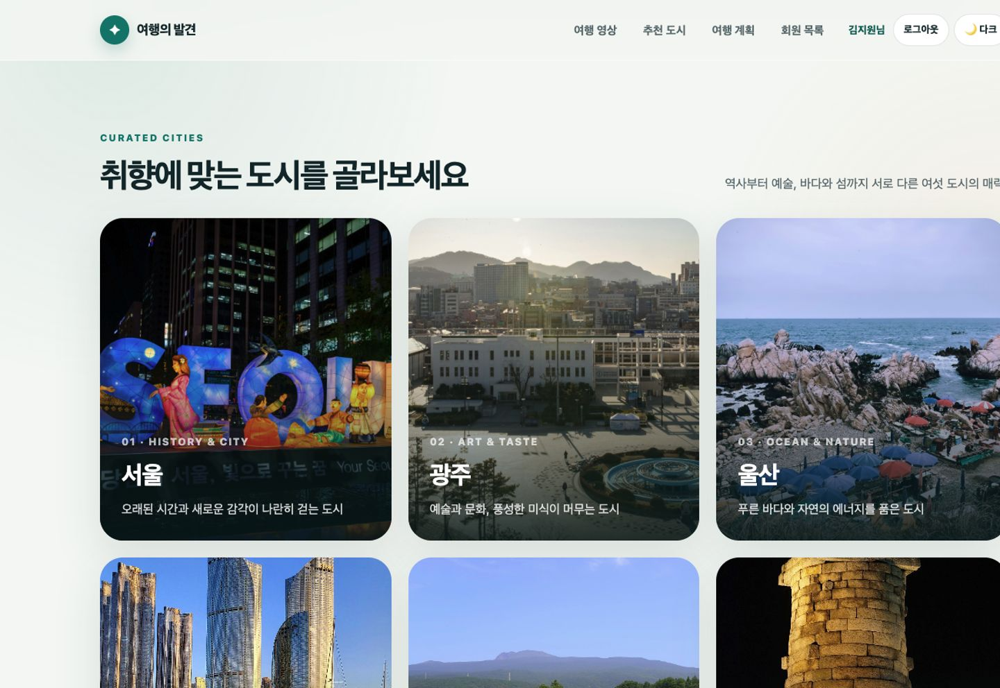

- 서울, 광주, 울산, 부산, 제주와 경주 여섯 도시를 3열 카드로 보여줍니다.
- 각 카드는 해당 도시의 상세 페이지와 연결되고 화면 너비에 따라 2열과 1열로 변경됩니다.
- 카드에 마우스를 올리면 위로 이동하고 그림자가 강조됩니다.

### 여행지 상세 페이지


- URL의 `city` 쿼리 파라미터에 따라 도시별 내용을 동적으로 표시합니다.
- 도시 소개, 추천 명소, 대표 먹거리, 여행 팁과 영상을 제공합니다.
- 해당 도시가 선택된 상태로 여행 계획 페이지에 이동할 수 있습니다.

#### 명소 갤러리

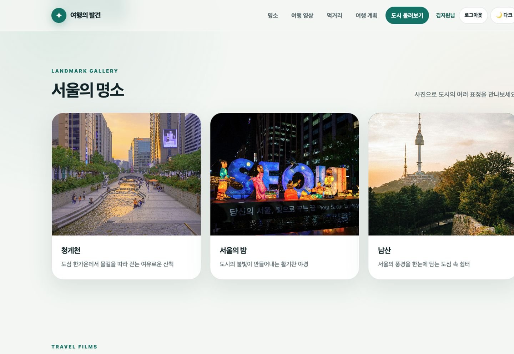

- 선택한 도시의 대표 명소를 이미지, 이름과 설명이 포함된 카드로 표시합니다.
- 이미지와 설명은 `figure`와 `figcaption`으로 연결하고 각 이미지에 의미 있는 대체 텍스트를 제공합니다.
- 카드에 마우스를 올리면 경계 안에서 이미지만 확대됩니다.

#### 대표 먹거리와 팁

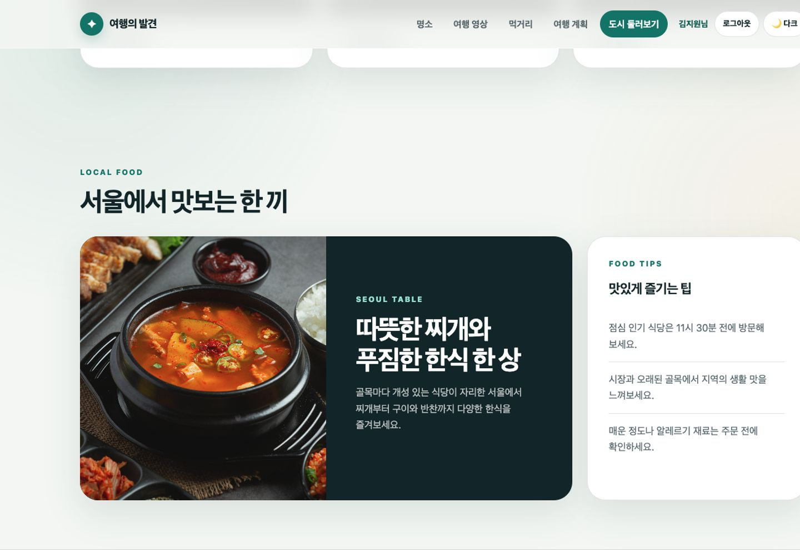

- 대표 음식은 독립적인 본문인 `article`, 추가 정보는 보조 영역인 `aside`로 구분했습니다.
- 음식 이미지와 설명, 방문 시간과 재료 확인 등 여행에 필요한 팁을 2단으로 보여줍니다.
- 작은 화면에서는 두 영역을 한 열로 재배치합니다.

### 여행 계획 페이지


- 여행지와 기간을 선택해 여행을 생성하고 수정·삭제할 수 있습니다.
- 날짜별 시간 일정과 준비 항목을 추가하고 완료 상태를 관리합니다.
- 일정 필터, 달력, 여행 기간과 D-day를 제공합니다.
- 로그인한 사용자별 여행 계획을 Local Storage에 저장합니다.

#### 여행 생성 다이얼로그

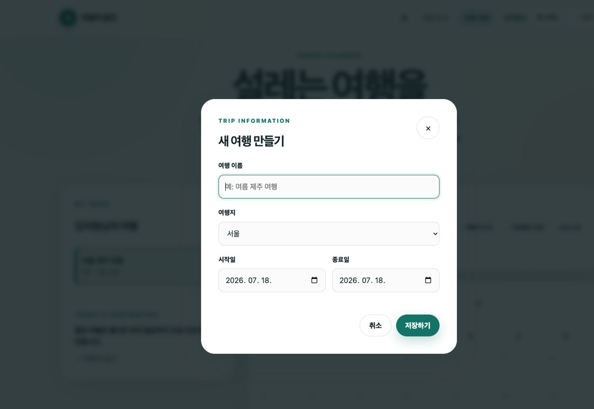

- 여행 이름, 여행지, 시작일과 종료일을 입력해 새로운 여행을 만듭니다.
- 브라우저 기본 `<dialog>`를 사용해 입력 중에는 배경 콘텐츠와 동작을 분리합니다.
- 시작일을 변경하면 종료일의 최소 날짜도 함께 변경됩니다.

#### 여행 달력

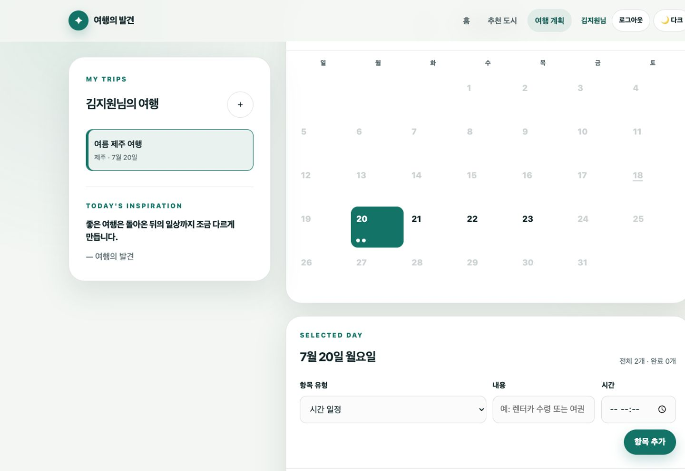

- 여행 기간이 포함된 월을 7열 달력으로 렌더링하고 여행 기간 밖의 날짜는 선택할 수 없게 처리합니다.
- 선택 날짜, 오늘 날짜와 일정이 있는 날짜를 서로 다른 상태로 표시합니다.
- 이전·다음 달 버튼으로 월을 이동할 수 있습니다.

#### 일정과 준비 항목

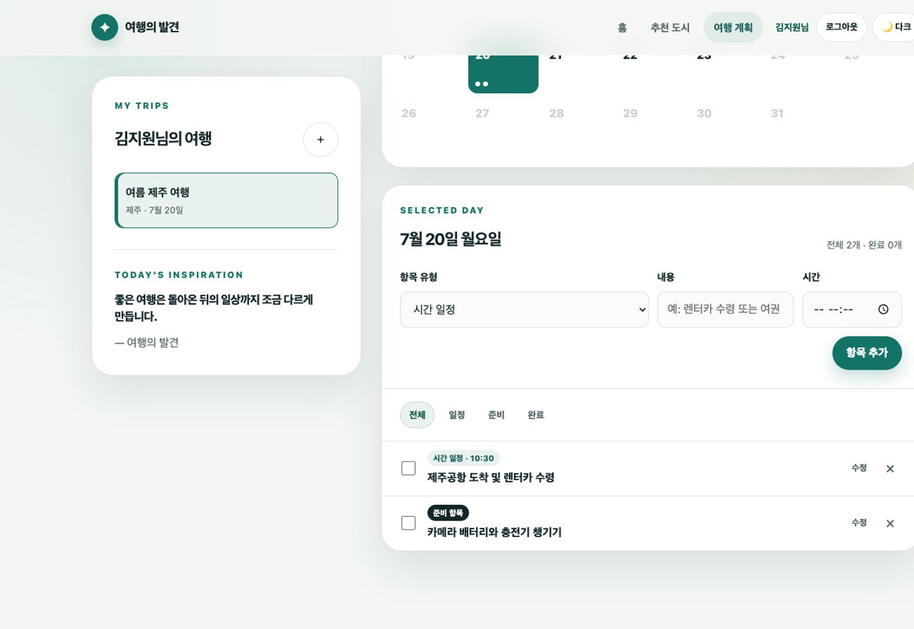

- 선택한 날짜에 시간 일정과 준비 항목을 추가하고 수정·삭제할 수 있습니다.
- 체크박스로 완료 상태를 바꾸고 전체·일정·준비·완료 필터로 목록을 구분합니다.
- 선택 날짜의 전체 항목 수와 완료 항목 수를 함께 표시합니다.

### 회원가입 페이지


- 사용자 이름, 아이디, 비밀번호와 추가 프로필 정보를 입력받습니다.
- 중복 아이디와 입력값을 검사하고 비밀번호를 PBKDF2 방식으로 처리합니다.
- 로그인한 사용자에 따라 여행 계획 데이터를 구분합니다.

#### 입력값 유효성 검증

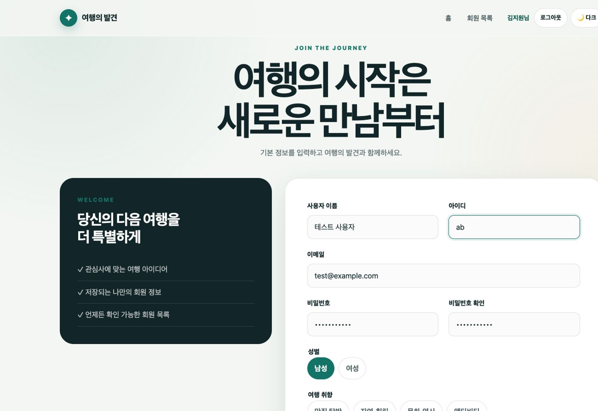

- 필수 입력, 이메일 형식, 아이디 길이와 패턴, 비밀번호 길이와 조합을 브라우저 기본 검증으로 확인합니다.
- 비밀번호 확인값 일치와 중복 아이디 여부는 JavaScript로 추가 검증합니다.
- 조건을 만족하지 않으면 제출을 차단하고 문제가 있는 입력 항목으로 포커스를 이동합니다.

### 로그인 페이지

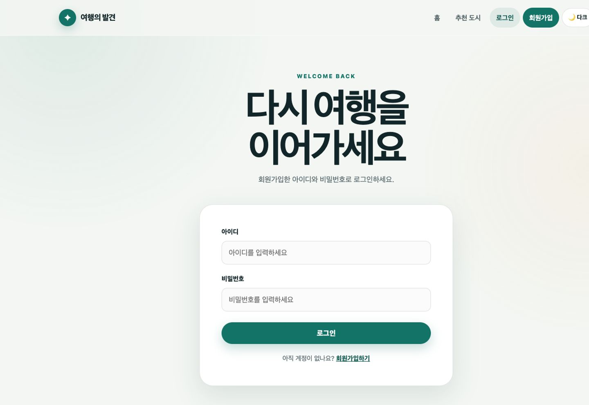

- 저장된 회원 아이디와 비밀번호를 검증해 로그인 세션을 생성합니다.
- 로그인하지 않은 상태에서 플래너에 접근하면 로그인 후 원래 페이지로 돌아갈 수 있도록 이동 경로를 전달합니다.
- 로그인 후에는 내비게이션의 로그인·회원가입 링크가 사용자 이름과 로그아웃 버튼으로 변경됩니다.

### 회원 목록 페이지

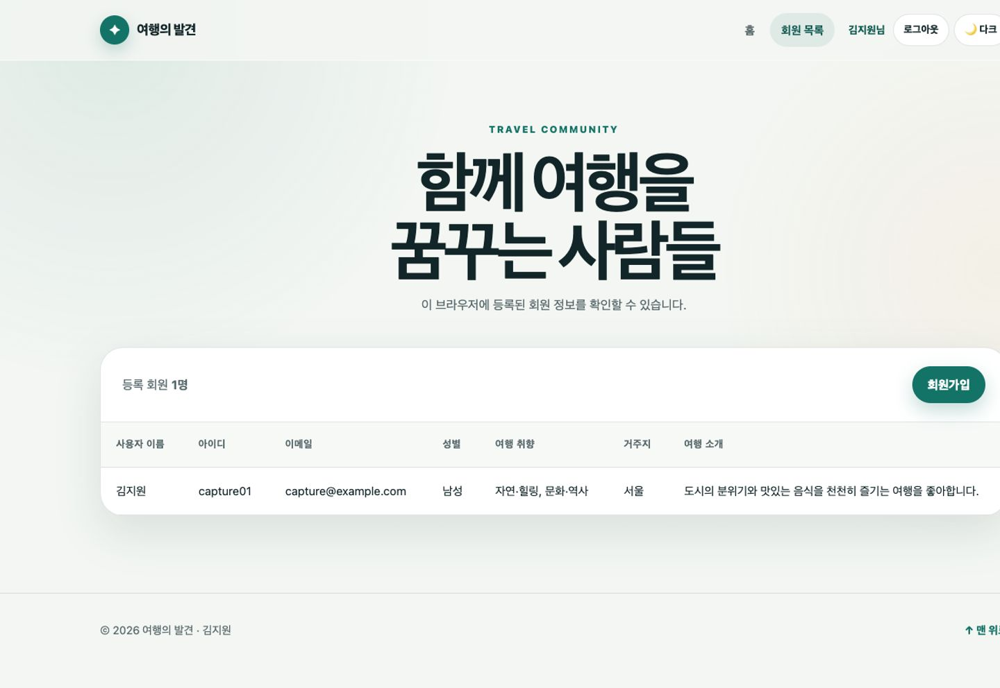

- 현재 브라우저의 Local Storage에 등록된 실습용 회원 정보를 표로 보여줍니다.
- JavaScript가 회원 데이터를 읽어 `<tbody>`에 행을 동적으로 생성합니다.
- 화면이 좁을 때는 표 영역을 가로로 스크롤해 내용을 확인할 수 있습니다.

### 다크모드와 모바일 화면

| 다크모드 | 모바일 화면 |
| --- | --- |
| 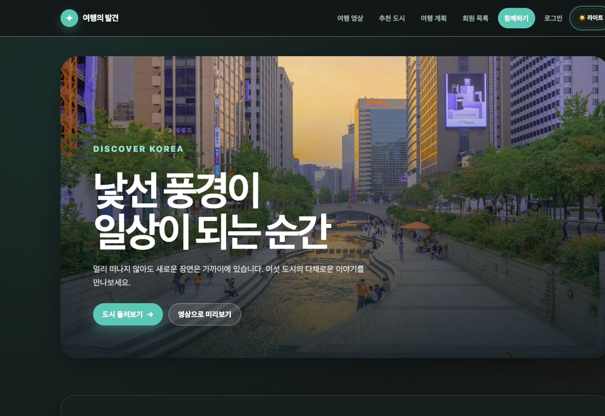 |  |

- CSS 변수 값을 변경하는 방식으로 라이트·다크 테마를 전환합니다.
- 선택한 테마는 Local Storage에 저장하고, 처음 방문하면 운영체제 설정을 참고합니다.
- 모바일에서는 내비게이션을 햄버거 메뉴로 변경하고 카드와 폼을 한 열로 재배치합니다.

#### 모바일 내비게이션

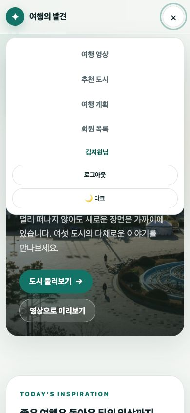

- 화면 폭이 600px 이하일 때 기존 가로 메뉴를 햄버거 버튼으로 전환합니다.
- 버튼을 누르면 주요 페이지, 로그인 상태, 로그아웃과 테마 버튼을 세로 메뉴로 표시합니다.
- 메뉴의 열림·닫힘 상태는 `aria-expanded`로 보조 기술에도 전달합니다.

## 페이지 구성

| 페이지 | 파일 | 역할 |
| --- | --- | --- |
| 메인 | `index.html` | 히어로, 여행 문구, 영상 캐러셀, 여행지 목록 |
| 여행지 상세 | `destination.html` | 선택한 도시의 명소·먹거리·영상·여행 팁 |
| 여행 플래너 | `planner.html` | 여행과 날짜별 일정 및 준비 항목 관리 |
| 로그인 | `login.html` | 사용자 인증과 세션 생성 |
| 회원가입 | `signup.html` | 입력 검증과 사용자 등록 |
| 회원 목록 | `result.html` | 현재 브라우저에 저장된 실습용 회원 목록 |

## 주요 기능과 소스코드

| 기능 | 설명 | 관련 파일 |
| --- | --- | --- |
| 여행지 데이터 | 여섯 도시의 소개·명소·먹거리·영상 데이터 관리 | `assets/js/data/destinations.js` |
| 여행지 목록 | 도시 데이터를 이용해 메인 카드를 동적으로 생성 | `assets/js/pages/destinations.js` |
| 여행지 상세 | `city` 파라미터를 읽어 선택한 도시 콘텐츠 렌더링 | `assets/js/pages/destination.js` |
| 영상 캐러셀 | 이전·다음 버튼과 영상 종료 이벤트로 영상 전환 | `assets/js/components/video-carousel.js` |
| 오늘의 문구 | JSON 데이터를 Fetch API로 읽어 무작위 문구 표시 | `assets/js/components/quote.js`, `assets/data/quotes.json` |
| 사용자 인증 | 회원가입, 로그인, 세션과 안전한 이동 경로 관리 | `assets/js/core/auth.js`, `assets/js/pages/login.js`, `assets/js/pages/signup.js` |
| 여행 플래너 | 여행·일정·준비 항목 CRUD와 달력 렌더링 | `assets/js/pages/app.js` |
| 브라우저 저장소 | 회원과 사용자별 여행 계획의 Local Storage 처리 | `assets/js/core/storage.js` |
| 공통 UI | 내비게이션, 테마, 로그아웃, 상단 이동 버튼 | `assets/js/core/common.js` |

## 기술별 구현 내용

### HTML

| 적용 페이지 | 사용 요소 | 구현 내용 |
| --- | --- | --- |
| 전체 | `header`, `nav`, `main`, `section`, `footer` | 페이지 구조와 콘텐츠 영역을 의미에 따라 구분 |
| 메인 | `figure`, `video`, `article` | 여행 영상과 추천 도시 카드 구성 |
| 상세 | `article`, `figure`, `video` | 명소, 먹거리와 영상 콘텐츠 구성 |
| 플래너 | `aside`, `form`, `dialog` | 여행 목록, 일정 폼과 여행 편집 창 구성 |
| 로그인·회원가입 | `form`, `fieldset`, `input`, `select` | 인증 및 사용자 정보 입력 구성 |
| 회원 목록 | `table` | 가입된 실습용 사용자 데이터를 표로 표시 |
| 동적 영역 | `aria-label`, `aria-live`, `aria-current` | 현재 상태와 변경되는 콘텐츠의 접근성 보완 |

### CSS

| 적용 페이지 | 사용 기술 | 구현 내용 |
| --- | --- | --- |
| 전체 | CSS 변수 | 색상, 배경, 테두리와 간격을 일관되게 관리 |
| 전체 | Flexbox | 내비게이션, 버튼 그룹과 폼 요소 정렬 |
| 메인·상세 | CSS Grid | 여행지, 명소와 먹거리 카드 배치 |
| 플래너 | Grid, 상태 클래스 | 사이드바, 달력, 일정과 완료 상태 표현 |
| 전체 | Media Query | 모바일 내비게이션과 반응형 레이아웃 적용 |
| 상호작용 요소 | `hover`, `focus`, 활성 클래스 | 현재 선택과 키보드 포커스를 시각적으로 구분 |
| 전체 | 다크 테마 클래스 | 저장된 테마에 따라 페이지 색상 전환 |

### JavaScript

| 적용 페이지 | 사용 기술 | 구현 내용 |
| --- | --- | --- |
| 전체 | ES Modules | 데이터, 저장소, 인증, 컴포넌트와 페이지 로직 분리 |
| 메인 | Fetch API | JSON 여행 문구를 읽어 화면에 표시 |
| 메인 | DOM·미디어 이벤트 | 여행지 카드 생성과 영상 캐러셀 제어 |
| 상세 | URLSearchParams | `city` 값에 맞는 도시 콘텐츠 렌더링 |
| 회원가입 | Web Crypto API | PBKDF2 SHA-256 방식으로 비밀번호 처리 |
| 로그인·전체 | Local Storage | 회원, 세션, 테마와 사용자별 여행 계획 유지 |
| 플래너 | DOM·이벤트·CRUD | 달력과 여행·일정·준비 항목의 생성·수정·삭제 |

## 페이지별 기술 적용 위치

| 페이지 | HTML | CSS | JavaScript |
| --- | --- | --- | --- |
| 메인 | `header`, `nav`, `section`, `figure`, `video` | Sticky Header, Grid 카드, 영상 오버레이, 히어로 애니메이션 | 여행지 렌더링, Fetch 문구, 영상 캐러셀, 배경 전환 |
| 여행지 상세 | `article`, `aside`, `figure`, `video` | 명소 Grid, 음식 2열 레이아웃, 반응형 1열 전환 | URL 파라미터, 도시 데이터 렌더링, 이미지 Lazy Loading |
| 여행 플래너 | `aside`, `section`, `form`, `dialog` | Sticky Sidebar, 7열 Calendar Grid, 상태 클래스 | 여행·일정 CRUD, 날짜 계산, 필터, 이벤트 위임, Local Storage |
| 회원가입 | `form`, `fieldset`, `legend`, `input`, `select` | 2열 Form Grid, Sticky 안내 카드, 선택 상태 | 입력 검증, 중복 확인, PBKDF2 비밀번호 처리 |
| 로그인 | `form`, `input` | 인증 카드, 포커스·오류 상태 | 비동기 인증, 세션 저장, 안전한 Redirect |
| 회원 목록 | `table`, `thead`, `tbody` | 테이블 카드, 가로 스크롤 | 저장된 회원 데이터로 표 행 생성 |
| 전체 | `header`, `nav`, `main`, `footer` | CSS 변수, 다크모드, Media Query | 공통 메뉴, 테마, 로그아웃, 상단 이동 버튼 |

## 평가 항목과 다른 구현 방식

평가 가이드의 기본 구현을 그대로 반복하기보다 여행 서비스의 흐름에 맞춰 일부 기술을 확장하거나 다른 방식으로 선택했습니다. 아래 내용은 평가 항목의 방식과 현재 구현의 차이, 장단점과 선택 이유를 정리한 것입니다.

### Fixed Header 대신 Sticky Header

| 비교 항목 | 평가 가이드의 Fixed | 현재 구현의 Sticky |
| --- | --- | --- |
| 위치 기준 | 브라우저 화면을 기준으로 처음부터 고정 | 원래 위치에서 시작해 상단에 도달하면 고정 |
| 문서 흐름 | 문서 흐름에서 제외 | 원래 공간을 유지 |
| 본문 겹침 | 헤더 높이만큼 별도 여백이 필요할 수 있음 | 본문과 겹칠 가능성이 비교적 적음 |
| 적용 위치 | 상단 헤더 | 상단 헤더, 회원가입 안내, 여행 목록 |

상단 메뉴를 계속 사용할 수 있으면서 본문을 가리지 않도록 Fixed 대신 Sticky를 선택했습니다. Sticky는 문서 흐름을 유지해 별도의 상단 여백을 계산하지 않아도 된다는 장점이 있지만 부모 요소의 높이와 `overflow` 설정에 영향을 받을 수 있습니다. 작은 화면에서는 고정된 사이드 영역이 공간을 많이 차지하므로 회원가입 안내와 여행 목록을 일반 배치로 전환했습니다.

Fixed 기술은 화면의 같은 위치에 계속 있어야 하는 맨 위로 이동 버튼과 배경 장식에 사용했습니다. Fixed는 부모 영역과 관계없이 항상 접근할 수 있다는 장점이 있지만 문서 흐름에서 제외되어 콘텐츠를 가릴 수 있다는 단점이 있습니다.

### GET 폼 전송 대신 JavaScript와 Local Storage

| 비교 항목 | 기본 GET 전송 | 현재 구현 |
| --- | --- | --- |
| 데이터 전달 | URL 쿼리스트링 | JavaScript 객체와 Local Storage |
| 제출 이후 | 결과 페이지에서 현재 입력값 확인 | 로그인 페이지로 이동한 후 인증 진행 |
| 복수 사용자 | 별도의 누적 처리 필요 | 회원 배열에 여러 사용자 누적 |
| 민감 정보 | URL에 값이 노출될 수 있음 | 비밀번호가 URL에 포함되지 않음 |
| 데이터 유지 | URL이 남아 있는 동안 확인 가능 | 같은 브라우저에서 새로고침 후에도 유지 |

단순히 입력값 한 건을 결과 페이지에 전달하는 대신 회원가입, 로그인과 사용자별 여행 계획을 연결하기 위해 Local Storage 방식을 선택했습니다. 여러 사용자를 누적하고 관심 분야 복수 선택을 배열로 유지할 수 있다는 장점이 있습니다. 반면 GET 방식의 쿼리스트링과 `name` 기반 전송 과정을 직접 보여주지 못하며, 데이터가 다른 기기나 브라우저와 공유되지 않는다는 한계가 있습니다.

### 제출 결과 한 건 대신 누적 회원 목록

평가 가이드에서는 제출 직후 한 명의 입력값을 표로 표시하지만, 현재 `result.html`은 브라우저에 등록된 모든 회원을 표로 보여줍니다. 회원 데이터와 로그인 기능을 연결하고 여러 행을 누적해서 보여줄 수 있다는 장점이 있습니다. 반면 현재 제출값을 URL에서 읽는 과정은 포함하지 않으며 Local Storage를 비우면 회원 목록도 사라집니다.

### HTML 기본 검증과 JavaScript 추가 검증

| 검증 종류 | HTML 기본 검증 | JavaScript 추가 검증 |
| --- | --- | --- |
| 필수 입력 | `required` | 제출 전 전체 유효성 재확인 |
| 길이 제한 | `minlength`, `maxlength` | 다른 입력값과의 관계 확인 |
| 아이디 형식 | `pattern` | 기존 아이디 중복 확인 |
| 이메일 형식 | `type="email"` | 기존 회원 이메일 비교 |
| 비밀번호 | 길이와 조합 패턴 | 비밀번호 확인값과 일치 검사 |

브라우저가 처리할 수 있는 형식 검증은 HTML 속성에 맡기고, 두 입력값 또는 저장된 데이터와 비교해야 하는 검증만 JavaScript로 처리했습니다. 기본 기능을 중복 구현하지 않으면서 복잡한 조건을 추가할 수 있다는 장점이 있습니다. 다만 검증 로직이 HTML과 JavaScript에 나뉘며 실제 서비스에서는 서버 측 검증도 필요합니다.

### 비밀번호 원문 대신 Web Crypto API

| 비교 항목 | 단순 원문 저장 | 현재 PBKDF2 처리 |
| --- | --- | --- |
| 저장 내용 | 사용자가 입력한 비밀번호 | 임의 Salt와 파생된 값 |
| 처리 방식 | 단순 문자열 저장 | 비동기 암호 연산 |
| 구현 난이도 | 낮음 | 상대적으로 높음 |
| 원문 노출 | 직접 노출 가능 | 원문을 저장하지 않음 |

비밀번호 원문을 그대로 저장하지 않기 위해 Web Crypto API의 PBKDF2 SHA-256 방식을 사용했습니다. 사용자마다 임의 Salt를 생성하고 120,000회 반복한 파생값을 저장합니다. 원문 저장보다 직접적인 노출 가능성을 줄일 수 있지만 모든 처리와 데이터가 브라우저에 있으므로 실제 서버 인증과 같은 보안 수준은 아닙니다. 보안 완성보다는 비밀번호를 원문으로 다루지 않는 방식과 비동기 암호 처리를 학습하기 위한 선택입니다.

### 전화번호 입력 항목

평가 가이드의 `tel` 입력과 전화번호 패턴은 현재 회원가입 페이지에 적용되지 않았습니다. 다른 기술로 대체된 항목이 아니라 현재 구현에서 빠진 항목입니다. 현재 회원가입에서는 text, password, email, radio, checkbox, select와 textarea를 사용하며, date와 time은 여행 플래너에서 사용합니다.

### 정적 날짜 제한 대신 동적 날짜 범위 검증

여행 생성 창에서는 시작일과 종료일에 date 입력을 사용합니다. 고정된 최소·최대 날짜를 HTML에 작성하는 대신 사용자가 시작일을 변경하면 종료일의 최소값도 같은 날짜로 변경됩니다. 여행 기간이라는 실제 상황에 맞게 검증 조건을 동적으로 적용할 수 있다는 장점이 있지만 JavaScript가 필요하고 HTML만 확인해서는 전체 검증 과정을 파악하기 어렵다는 단점이 있습니다.

### 단순 Todo 대신 날짜별 여행 플래너

| 비교 항목 | 기본 Todo | 현재 여행 플래너 |
| --- | --- | --- |
| 데이터 | 내용과 완료 여부 | 내용, 완료 여부, 유형, 날짜와 시간 |
| 목록 구조 | 하나의 전체 목록 | 사용자·여행·날짜별 목록 |
| 주요 기능 | 추가, 완료, 삭제 | 여행과 일정의 생성·조회·수정·삭제 |
| 날짜 기능 | 없음 | 여행 기간, 월별 달력과 D-day |
| 항목 유형 | 하나 | 시간 일정과 준비 항목 |

기본 Todo의 배열 상태와 렌더링 흐름을 여행 서비스에 맞게 확장했습니다. 실제 사용 목적이 분명하고 중첩 객체, 날짜 계산과 여러 상태의 관계를 학습할 수 있다는 장점이 있습니다. 반면 선택한 여행, 날짜, 월, 필터와 수정 상태를 함께 관리해야 하므로 단순 Todo보다 코드와 상태 구조가 복잡합니다.

### 진행중 필터 대신 일정 유형 필터

평가 가이드의 필터는 전체·진행중·완료이지만 현재 플래너는 전체·일정·준비·완료로 구성했습니다. 여행 중 수행할 시간 일정과 출발 전 준비물을 구분하는 것이 서비스 목적에 더 적합하다고 판단했습니다. 유형별로 빠르게 확인할 수 있다는 장점이 있지만 완료되지 않은 항목만 모아 보는 진행중 필터는 제공하지 않습니다.

### 이벤트 위임에 수정 기능 추가

동적으로 생성되는 일정의 완료, 수정과 삭제는 부모 목록에 등록한 하나의 이벤트 리스너에서 처리합니다. 항목마다 이벤트를 다시 등록하지 않아도 되고 새로 생성한 항목에도 같은 로직이 적용된다는 장점이 있습니다. 반면 DOM 구조와 `data-action` 값에 의존하므로 마크업을 변경할 때 이벤트 처리 규칙도 함께 확인해야 합니다.

### Enter 입력과 Form 제출 로직 재사용

Enter 키를 눌렀을 때 별도의 추가 로직을 실행하지 않고 기존 Form 제출 흐름을 호출합니다. 추가 버튼과 Enter 키가 동일한 검증, 저장과 렌더링 로직을 사용하므로 중복 코드가 줄고 수정 상태에서도 같은 동작을 유지할 수 있습니다. 다만 여러 줄 입력이 필요한 요소에는 같은 방식을 적용하기 어렵고 Enter 기본 동작을 막는 범위를 주의해야 합니다.

### Todo 전용 저장소 대신 범용 저장소 모듈

| 비교 항목 | Todo 전용 저장소 | 현재 범용 저장소 |
| --- | --- | --- |
| 저장 대상 | Todo 배열 하나 | 회원, 세션, 테마와 여행 계획 |
| 재사용 | 다른 기능마다 코드 추가 | 공통 읽기·저장 함수 재사용 |
| 구조 파악 | 저장 데이터가 명확함 | 키별 데이터 구조를 별도로 알아야 함 |

Local Storage의 JSON 변환과 오류 처리를 반복하지 않도록 범용 저장소 모듈을 만들었습니다. 여러 페이지가 같은 저장 방식을 재사용할 수 있다는 장점이 있지만 키마다 어떤 데이터 구조가 들어가는지 저장소 파일만 보고 파악하기 어렵고 별도의 스키마 검증이 없다는 단점이 있습니다.

### 메뉴 숨김 대신 햄버거 메뉴

| 비교 항목 | 모바일 메뉴 숨김 | 현재 햄버거 메뉴 |
| --- | --- | --- |
| 화면 공간 | 메뉴 영역 제거 | 버튼 하나만 표시 |
| 페이지 이동 | 숨긴 메뉴에는 접근할 수 없음 | 버튼을 눌러 전체 메뉴 사용 가능 |
| 구현 | CSS만으로 가능 | CSS와 JavaScript 상태 관리 필요 |
| 접근성 상태 | 별도 상태 없음 | `aria-expanded`로 열림 상태 제공 |

모바일에서 내비게이션을 완전히 제거하면 다른 페이지로 이동하기 어려워지므로 햄버거 메뉴로 대체했습니다. 화면 공간을 절약하면서 메뉴 접근을 유지할 수 있지만 열림·닫힘 상태와 키보드 사용성을 함께 관리해야 합니다.

### 한 속성의 배경 결합 대신 가상 요소 오버레이

히어로 이미지와 Gradient를 하나의 Background 속성에 결합하지 않고 이미지 배경과 가상 요소 오버레이를 별도 레이어로 분리했습니다. JavaScript가 배경 이미지만 순환해서 바꿔도 Gradient가 그대로 유지되고 오버레이 명도를 독립적으로 조절할 수 있다는 장점이 있습니다. 반면 `position`, `z-index`와 레이어 순서를 함께 관리해야 하며 잘못 설정하면 콘텐츠가 가려질 수 있습니다.

### 카드 전체 이동과 이미지 확대의 분리

여행지 카드는 위로 이동하면서 그림자가 강해지고, 명소 카드는 카드 크기를 유지한 채 내부 이미지만 확대됩니다. 콘텐츠 종류에 따라 다른 Hover 피드백을 줄 수 있고 이미지 확대가 카드 경계 안에서만 보인다는 장점이 있습니다. 반면 카드마다 상호작용 규칙이 달라질 수 있으며 터치 환경에서는 Hover 효과를 동일하게 경험하기 어렵습니다.

### Grid와 Flexbox의 역할 분리

| 비교 항목 | CSS Grid | Flexbox |
| --- | --- | --- |
| 배치 기준 | 행과 열을 함께 관리 | 한 방향을 중심으로 정렬 |
| 적용 위치 | 여행지, 명소, 폼, 플래너와 달력 | 내비게이션, 버튼, 일정 항목과 푸터 |
| 장점 | 반복되는 여러 열과 반응형 구조에 적합 | 한 줄 정렬과 간격 분배가 간결함 |
| 단점 | 단순 한 줄 배치에는 과할 수 있음 | 여러 행과 열을 동시에 맞추기 어려움 |

여행지와 명소는 같은 크기의 카드가 반복되고 달력은 일곱 개 열이 필요하므로 Grid를 사용했습니다. 내비게이션과 일정 항목은 한 방향 정렬이 중요하므로 Flexbox를 사용했습니다.

### 도시별 HTML 대신 하나의 상세 페이지 재사용

도시마다 별도의 HTML을 만들지 않고 URL의 도시 값을 읽어 하나의 상세 페이지에 해당 데이터를 렌더링합니다. 공통 레이아웃을 한 번만 관리하고 새로운 도시를 데이터 중심으로 추가할 수 있다는 장점이 있습니다. 반면 JavaScript가 실행되지 않으면 상세 콘텐츠가 표시되지 않으며 공통 데이터 구조에 문제가 생기면 여러 도시에 동시에 영향을 줄 수 있습니다.

### 단일 JavaScript 파일 대신 ES Modules

JavaScript를 저장소, 인증, 공통 UI, 여행지 데이터, 컴포넌트와 페이지 기능으로 분리했습니다. 각 파일의 책임과 의존 관계를 구분하고 공통 기능을 여러 페이지에서 재사용할 수 있다는 장점이 있습니다. 반면 파일 수와 연결 관계가 늘어나고 로컬 파일 직접 실행에서는 모듈과 데이터 요청이 제한될 수 있어 HTTP 서버가 필요합니다.

### Local Storage와 서버 데이터베이스의 차이

| 비교 항목 | Local Storage | 서버 데이터베이스 |
| --- | --- | --- |
| 설치와 구성 | 별도 서버 없이 사용 | 서버와 데이터베이스 필요 |
| 데이터 공유 | 같은 브라우저에서만 사용 | 여러 기기와 사용자 간 공유 가능 |
| 권한과 보안 | 사용자가 직접 수정 가능 | 서버에서 권한과 검증 처리 가능 |
| 적합한 목적 | 프론트엔드 실습과 간단한 상태 유지 | 실제 서비스 데이터 관리 |

백엔드 없이 회원, 로그인 상태와 사용자별 여행 계획을 유지하기 위해 Local Storage를 선택했습니다. 구현과 확인이 간단하지만 기기 간 동기화, 안전한 권한 관리와 대용량 데이터 처리에는 적합하지 않습니다.

### 기본 애니메이션에 모션 감소 환경 추가

히어로 문구와 카드에는 등장 애니메이션을 적용했지만 사용자가 운영체제에서 동작 줄이기를 설정한 경우 CSS 애니메이션과 JavaScript 배경 전환을 최소화합니다. 사용자 환경을 존중한다는 장점이 있지만 모션 감소 환경에서는 의도한 시각 효과를 모두 보여주지 않습니다. CSS와 JavaScript 양쪽에서 설정을 확인해야 한다는 관리 비용도 있습니다.

### 접근성 상태 추가

| 적용 기술 | 역할 |
| --- | --- |
| `aria-current` | 현재 선택된 페이지 표시 |
| `aria-expanded` | 모바일 메뉴의 열림·닫힘 상태 제공 |
| `aria-live` | 달력 제목과 일정 목록 변경 안내 |
| `aria-label` | 아이콘 버튼과 동적 일정 버튼의 목적 설명 |
| `focus-visible` | 키보드 사용자의 현재 포커스 표시 |
| `prefers-reduced-motion` | 사용자의 모션 감소 설정 반영 |
| Lazy Loading | 화면 아래 이미지의 초기 로딩 부담 감소 |

접근성 속성은 디자인을 크게 바꾸지 않으면서 키보드 사용자와 보조 기술에 현재 상태와 동작 목적을 전달합니다. 다만 속성만 추가하는 것으로 접근성이 완성되지는 않으므로 실제 키보드 이동과 읽기 순서도 함께 확인해야 합니다.

## 평가 기준 대비 핵심 요약

| 평가 가이드 | 현재 구현 | 구분 | 핵심 트레이드오프 |
| --- | --- | --- | --- |
| Fixed Header | Sticky Header | 대체 구현 | 콘텐츠 겹침은 줄지만 Fixed 요구와 문자가 다름 |
| Fixed 위치 기술 | 맨 위로 버튼과 배경 장식 | 적용 | 항상 접근 가능하지만 문서 흐름에서 제외 |
| GET 폼 전송 | JavaScript와 Local Storage | 확장 구현 | 상태 관리는 확장됐지만 쿼리스트링 학습은 줄어듦 |
| 제출값 한 건 표시 | 누적 회원 목록 | 확장 구현 | 여러 회원을 표시하지만 현재 제출값 전달 방식과 다름 |
| HTML 검증 | HTML 검증과 JavaScript 비교 검증 | 확장 구현 | 복잡한 검증이 가능하지만 로직이 두 영역으로 나뉨 |
| 비밀번호 입력 | PBKDF2 파생값 저장 | 추가 구현 | 원문 저장을 피하지만 실제 서버 인증은 아님 |
| 전화번호 `tel` | 미적용 | 미구현 | 평가 필수라면 추가 필요 |
| 정적 날짜 제한 | 시작일 기반 동적 종료일 제한 | 확장 구현 | 실제 상황에 적합하지만 JavaScript 의존 |
| 단순 Todo | 날짜별 여행 플래너 | 확장 구현 | 활용도는 높지만 상태 구조가 복잡함 |
| 전체·진행중·완료 | 전체·일정·준비·완료 | 일부 대체 | 유형 구분은 가능하지만 진행중 필터가 없음 |
| 개별 항목 이벤트 | 부모 목록 이벤트 위임 | 요구 충족·확장 | 동적 항목 처리가 쉽지만 DOM 규칙에 의존 |
| 모바일 메뉴 숨김 | 햄버거 메뉴 | 개선형 대체 | 메뉴 접근을 유지하지만 JS 상태 관리 필요 |
| 배경 이미지와 Gradient 결합 | 가상 요소 오버레이 분리 | 대체 구현 | 레이어 제어는 쉽지만 z-index 관리 필요 |
| 카드 Hover 확대 | 카드 이동과 이미지 확대 분리 | 확장 구현 | 콘텐츠별 효과가 다르지만 규칙이 늘어남 |
| Todo 전용 저장소 | 범용 저장소 모듈 | 확장 구현 | 재사용성이 높지만 데이터 구조 파악이 어려움 |
| 단일 JavaScript 파일 | ES Modules | 확장 구현 | 유지보수성이 높지만 서버 실행이 필요 |
| 기본 등장 애니메이션 | 모션 감소 환경 지원 | 접근성 확장 | 사용자 설정을 존중하지만 효과가 줄어들 수 있음 |

## 데이터 저장 방식

회원 정보, 로그인 상태와 여행 계획은 브라우저 Local Storage에 저장됩니다. 서버에 저장되는 데이터가 아니므로 브라우저나 기기가 달라지면 기존 데이터가 공유되지 않습니다. 인증과 회원 목록 역시 프론트엔드 기술을 연습하기 위한 실습용 기능입니다.

## 폴더 구조

```text
day1/
├── assets/
│   ├── css/                 # 공통 스타일
│   ├── data/                # 여행 문구 JSON
│   ├── images/              # 공통 및 도시별 이미지
│   ├── js/
│   │   ├── components/      # 영상 캐러셀, 오늘의 문구
│   │   ├── core/            # 인증, 저장소, 공통 기능
│   │   ├── data/            # 여행지 데이터
│   │   └── pages/           # 페이지별 동작
│   └── videos/              # 여행 영상
├── docs/images/             # README 실행 화면
├── destination.html
├── index.html
├── login.html
├── planner.html
├── result.html
└── signup.html
```

## 실행 방법

ES Modules와 JSON 요청을 정상적으로 사용하려면 저장소 루트에서 로컬 서버를 실행합니다.

```bash
python3 -m http.server 8000
```

브라우저에서 아래 주소로 접속합니다.

```text
http://localhost:8000/assignment/day1/index.html
```

## 결과물 자기평가

여행지 소개에 그치지 않고 회원가입과 로그인, 사용자별 여행 계획 관리까지 하나의 흐름으로 연결했습니다. JavaScript를 역할별 ES Module로 분리하고 공통 저장소와 인증 기능을 재사용해 페이지가 늘어나도 관리할 수 있는 구조를 연습했습니다. 특히 달력 기반의 일정 관리와 준비 항목 CRUD를 직접 구현하면서 DOM 렌더링, 이벤트 처리와 상태 관리의 관계를 이해할 수 있었습니다.

Local Storage 기반이므로 여러 기기에서 데이터를 공유하거나 실제 사용자 권한을 안전하게 관리할 수 없다는 한계가 있습니다. 이후 백엔드나 데이터베이스와 연결한다면 실제 서비스에 가까운 인증과 동기화 기능으로 발전시킬 수 있습니다.
