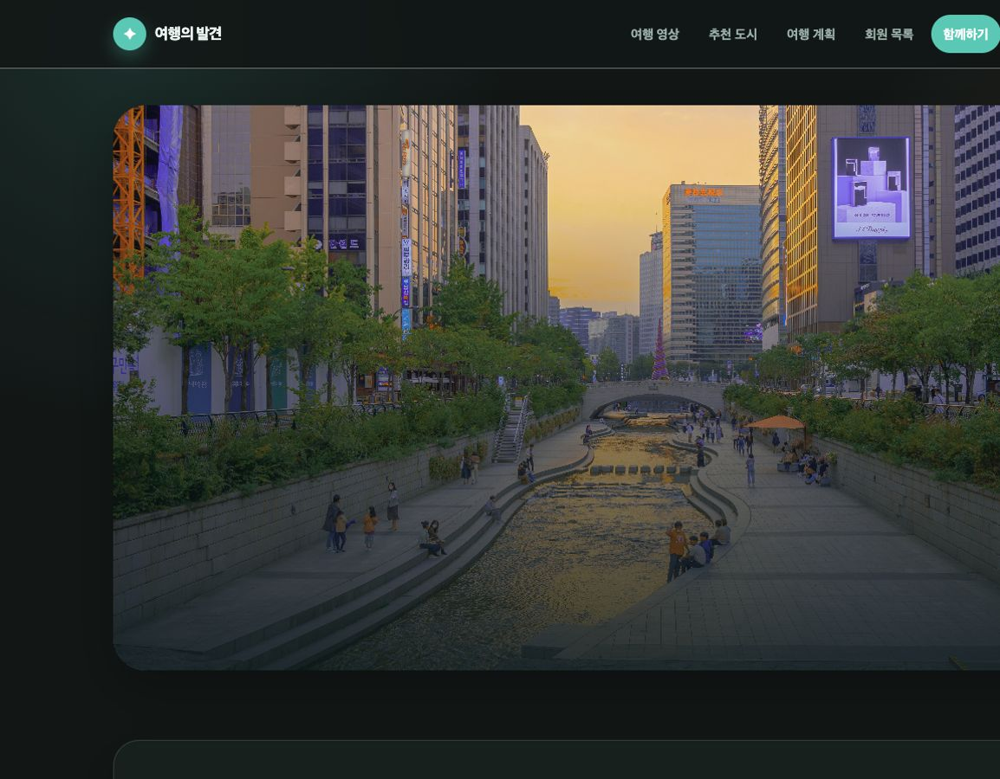
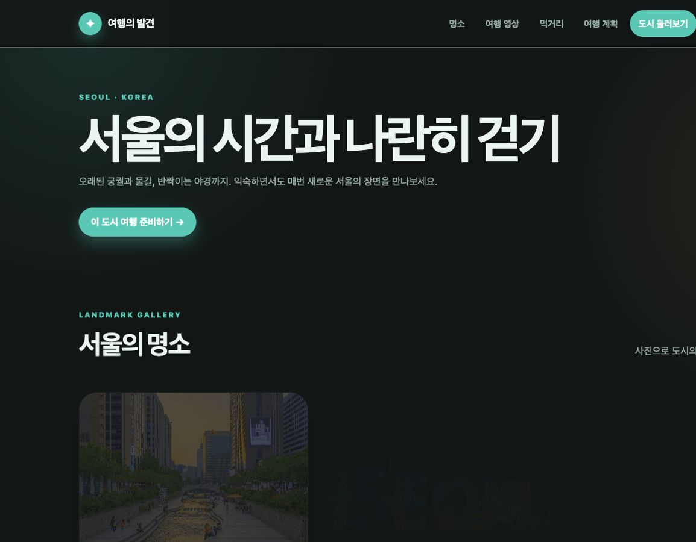
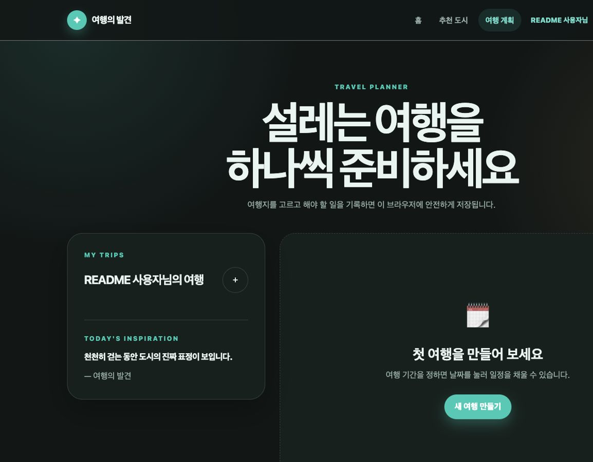
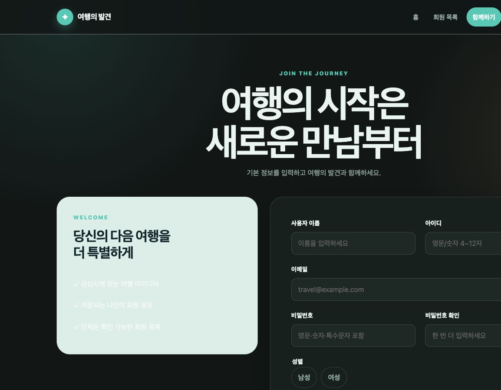

# 여행의 발견

국내 여섯 도시의 여행 정보를 둘러보고, 나만의 여행 일정과 준비 항목을 관리할 수 있는 웹사이트입니다. HTML, CSS, JavaScript의 기본 기능을 각각 분리해 구현하고 브라우저의 Local Storage를 이용해 사용자 데이터를 유지합니다.

## 프로젝트 화면

### 메인 페이지



- 여행 서비스의 전체 콘셉트와 추천 콘텐츠를 소개합니다.
- 영상 캐러셀, 오늘의 여행 문구, 여섯 도시의 여행지 카드를 제공합니다.
- 여행 계획, 회원가입, 로그인 등 각 기능 페이지로 이동할 수 있습니다.

### 여행지 상세 페이지



- URL의 `city` 쿼리 파라미터에 따라 도시별 콘텐츠를 동적으로 표시합니다.
- 도시 소개, 대표 이미지, 추천 장소 및 여행 영상을 제공합니다.
- 이전·다음 도시로 이동하거나 해당 도시의 여행 계획을 만들 수 있습니다.

### 여행 계획 페이지



- 여행지와 기간을 선택해 새로운 여행을 생성합니다.
- 달력에서 날짜를 선택하고 시간 일정 또는 준비 항목을 추가합니다.
- 일정의 완료 상태 변경, 수정, 삭제 및 필터링을 지원합니다.
- 작성한 여행 계획은 Local Storage에 저장되어 새로고침 후에도 유지됩니다.

### 회원가입 페이지



- 사용자 이름, 아이디, 비밀번호 등의 입력값을 검사합니다.
- 가입한 사용자 정보를 Local Storage에 저장합니다.
- 로그인 결과에 따라 사용자별 여행 계획을 구분합니다.

## 주요 기능

| 기능 | 설명 | 관련 파일 |
| --- | --- | --- |
| 여행지 목록 | JavaScript 데이터로 여섯 도시 카드를 동적으로 생성 | `assets/js/data/destinations.js`, `assets/js/pages/destinations.js` |
| 여행지 상세 | 쿼리 파라미터를 읽어 선택한 도시의 상세 콘텐츠 표시 | `destination.html`, `assets/js/pages/destination.js` |
| 영상 캐러셀 | 이전·다음 버튼으로 여행 영상을 순환 재생 | `assets/js/components/video-carousel.js` |
| 오늘의 문구 | JSON 데이터를 불러와 여행 문구와 작성자 표시 | `assets/data/quotes.json`, `assets/js/components/quote.js` |
| 사용자 인증 | 회원가입, 로그인 및 현재 로그인 사용자 관리 | `assets/js/core/auth.js`, `assets/js/pages/signup.js`, `assets/js/pages/login.js` |
| 여행 플래너 | 여행과 날짜별 일정 및 준비 항목 CRUD 제공 | `planner.html`, `assets/js/pages/app.js` |
| 데이터 저장 | 사용자와 여행 계획을 브라우저 Local Storage에 저장 | `assets/js/core/storage.js` |
| 공통 UI | 내비게이션, 테마, 연도 표시 등 공통 동작 처리 | `assets/js/core/common.js` |

## 기술별 구현 내용

### HTML

- `header`, `nav`, `main`, `section`, `article`, `footer` 등 시맨틱 태그로 페이지 구조를 구성했습니다.
- `video`, `form`, `dialog`, `input`, `select` 등 HTML 요소를 기능에 맞게 활용했습니다.
- `aria-label`, `aria-live`, `aria-current` 등의 속성을 적용해 접근성을 보완했습니다.
- 메인, 상세, 플래너, 로그인 및 회원가입 페이지를 목적에 따라 분리했습니다.

### CSS

- Flexbox와 Grid를 이용해 카드, 폼, 캘린더 및 상세 페이지 레이아웃을 구현했습니다.
- 공통 색상과 간격을 CSS 변수로 관리하고 일관된 디자인 시스템을 적용했습니다.
- 데스크톱과 모바일 화면에 대응하는 반응형 내비게이션과 레이아웃을 구성했습니다.
- 버튼, 카드, 입력창, 모달의 hover·focus·활성 상태를 구분했습니다.

### JavaScript

- ES Modules를 활용해 데이터, 공통 기능, 페이지 기능과 컴포넌트를 분리했습니다.
- DOM 조작으로 여행지 카드, 상세 정보, 달력과 일정 목록을 동적으로 렌더링합니다.
- 이벤트 처리로 폼 검증, 영상 전환, 여행 및 일정 CRUD를 구현했습니다.
- Local Storage를 이용해 회원 정보, 로그인 상태와 사용자별 여행 계획을 유지합니다.
- Fetch API로 JSON 문구 데이터를 읽고 화면에 표시합니다.

## 폴더 구조

```text
day1/
├── assets/
│   ├── css/                 # 공통 스타일
│   ├── data/                # 여행 문구 JSON
│   ├── images/              # 도시별 이미지
│   ├── js/
│   │   ├── components/      # 영상 캐러셀, 오늘의 문구
│   │   ├── core/            # 인증, 저장소, 공통 기능
│   │   ├── data/            # 여행지 데이터
│   │   └── pages/           # 페이지별 동작
│   └── videos/              # 여행 영상
├── destination.html         # 여행지 상세
├── index.html               # 메인
├── login.html               # 로그인
├── planner.html             # 여행 계획
├── result.html              # 회원 목록
└── signup.html              # 회원가입
```

## 실행 방법

ES Modules와 JSON 데이터 요청을 정상적으로 사용하려면 프로젝트 루트에서 로컬 서버를 실행합니다.

```bash
python3 -m http.server 8000
```

브라우저에서 다음 주소로 접속합니다.

```text
http://localhost:8000/assignment/day1/index.html
```

간단히 화면만 확인할 경우 [`index.html`](index.html)을 브라우저에서 직접 실행할 수도 있습니다.
