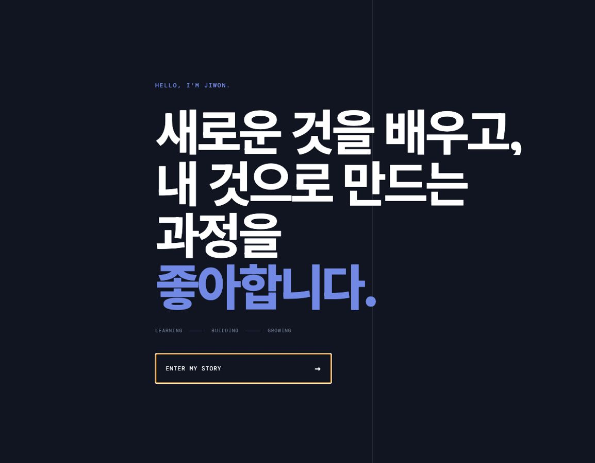
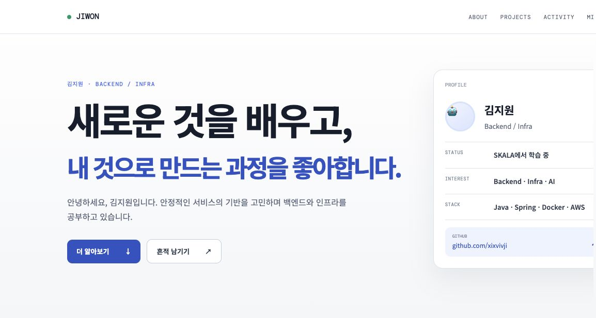
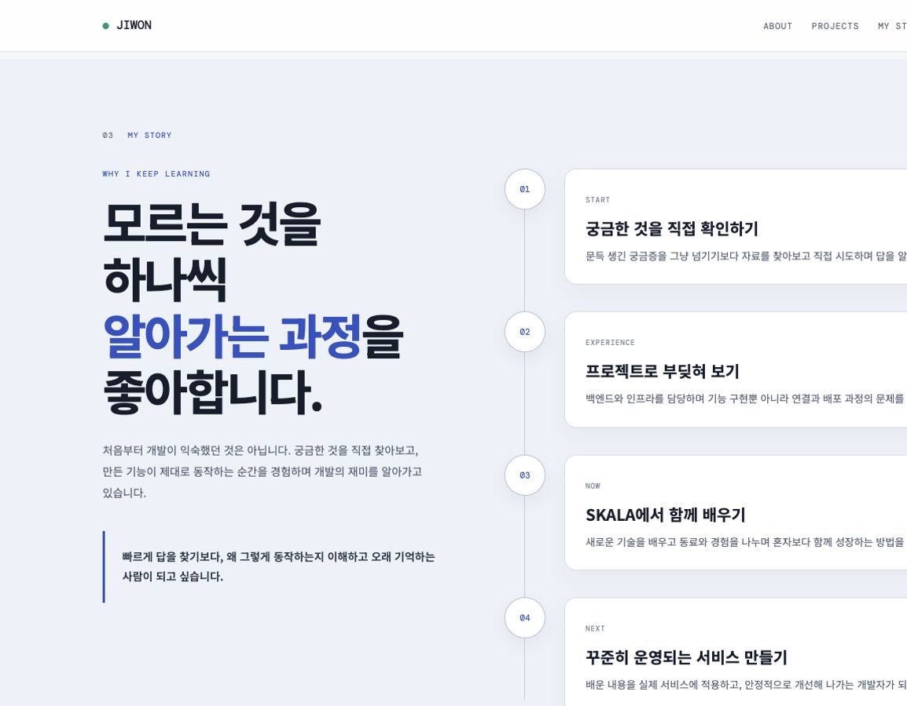
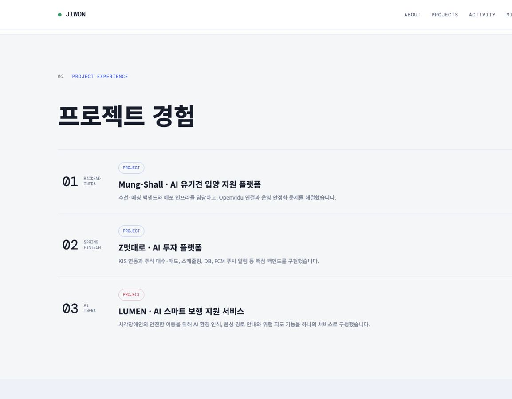
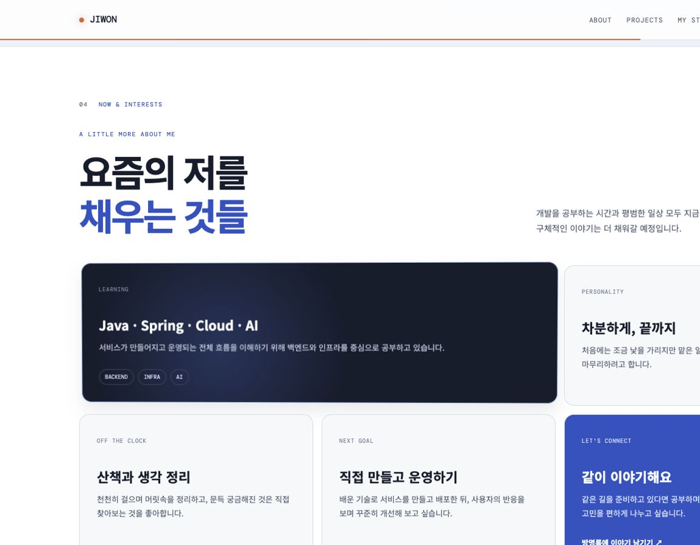
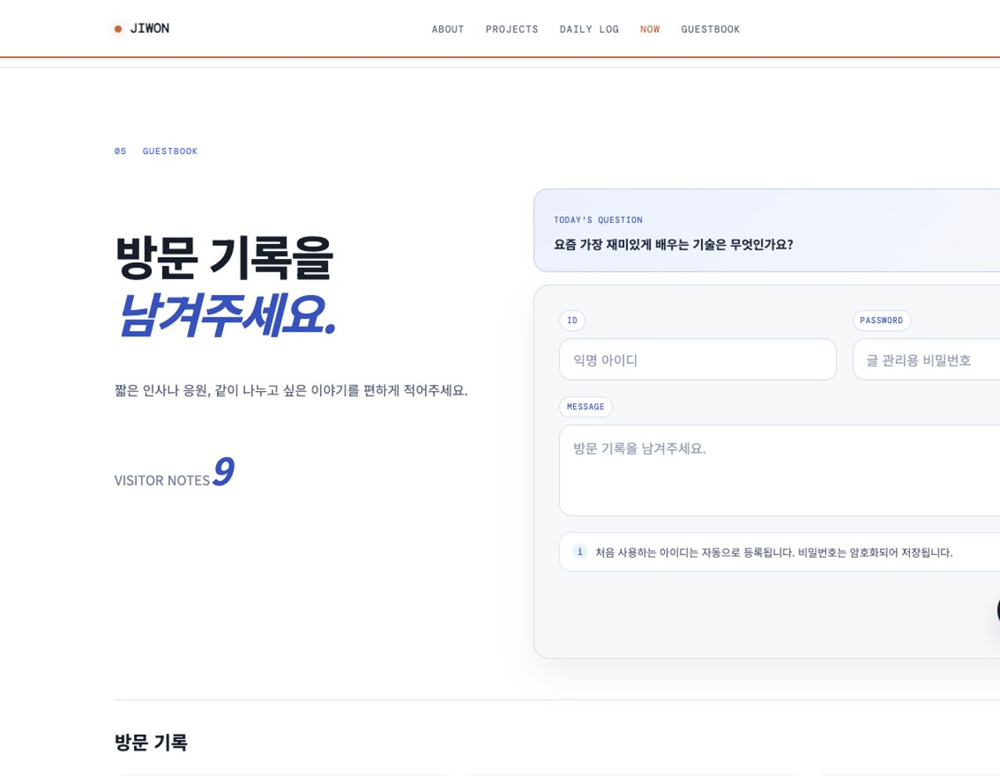

# JIWON — Personal Blog Portfolio

김지원이라는 사람의 성격, 관심사, 학습 과정과 일상을 프로젝트 경험과 함께 보여주는 개인 블로그형 포트폴리오입니다. 개발 이야기만 나열하기보다 방문자가 여러 콘텐츠를 직접 눌러보며 알아갈 수 있도록 인터랙티브한 한 페이지 사이트로 구성했습니다.

## 실행 결과

> 아래 이미지는 최종 화면을 캡처한 후 `docs/images/`의 같은 파일명으로 교체하면 됩니다.

### 첫 방문 인트로



- 환영 문구와 `DAILY / STUDY / STORY`가 순차적으로 나타납니다.
- `ENTER MY BLOG` 버튼으로 본문에 진입하고 `REPLAY INTRO`로 다시 볼 수 있습니다.
- 같은 브라우저 탭에서는 한 번만 자동 재생되며 Skip, Enter, Escape 키를 지원합니다.

### 메인 프로필



- 프로필 사진과 간단한 소개, 현재 상태와 관심사를 보여줍니다.
- GitHub 링크와 주요 콘텐츠로 이동하는 버튼을 제공합니다.

### About



- `나에 대해`, `공부`, `기록`, `취미`, `소통` 항목을 탭으로 탐색합니다.
- 선택한 항목에 따라 설명, 세부 카드와 키워드가 동적으로 바뀝니다.

### 프로젝트 경험

- Mung-Shall, Z-invest, LUMEN 프로젝트를 소개합니다.
- 카드를 선택하면 역할, 핵심 작업, 기술 스택과 소개 영상이 모달에 표시됩니다.
- 각 프로젝트의 GitHub 저장소로 이동할 수 있습니다.

### Daily Log



- 월별 캘린더에서 공개된 하루 기록을 날짜별로 확인합니다.
- 제목, 태그, 기분과 메모를 기록하고 최근 기록 3개와 월별 기록 수를 표시합니다.
- 기록은 온라인 저장소와 연결되어 여러 방문자가 같은 내용을 확인할 수 있습니다.

### Now & Interests



- 현재 배우는 내용, 성격, 취미, 목표와 소통 방식을 카드로 소개합니다.
- 마우스 위치에 따라 카드가 기울고 빛이 움직이는 3D 효과를 적용했습니다.

### Guestbook



- 아이디와 비밀번호로 방문 기록을 작성하고 글마다 댓글을 남길 수 있습니다.
- 방문 기록은 한 페이지에 6개씩 표시됩니다.
- 작성자 인증 후 글을 수정·삭제하거나 댓글을 삭제할 수 있습니다.
- 마지막으로 사용한 아이디를 Local Storage에 기억해 다음 입력에 활용합니다.

## 화면 구성

| 영역 | 주요 내용 | 핵심 인터랙션 |
| --- | --- | --- |
| Intro | 개인 블로그 환영 문구 | 순차 애니메이션, Skip, 다시 보기 |
| Hero | 프로필과 블로그 소개 | 섹션 이동, GitHub 링크 |
| About | 성격, 공부, 기록, 취미, 소통 | 탭 콘텐츠 전환 |
| Projects | 세 가지 프로젝트 경험 | 상세 모달, 영상 재생 |
| Daily Log | 날짜별 일상과 학습 기록 | 월 이동, 날짜 선택, 관리자 저장·삭제 |
| Now & Interests | 현재 관심사와 목표 | 포인터 기반 3D 카드 |
| Guestbook | 방문 기록과 댓글 | CRUD, 페이지네이션, 공용 인증 모달 |

## 주요 기능과 구현 방식

| 기능 | 설명 | 구현 방식 |
| --- | --- | --- |
| 첫 방문 인트로 | 문구 순차 등장, 본문 진입과 다시 보기 | CSS Keyframes, Session Storage, `inert` |
| About 탭 | 선택한 주제의 소개와 키워드 렌더링 | JavaScript 객체, DOM 조작, ARIA Tab |
| 프로젝트 상세 | 프로젝트별 설명, 기술과 영상 표시 | `<dialog>`, `<video>`, 포커스 트랩 |
| Daily Log | 공개 기록 조회 및 관리자 저장·삭제 | Calendar Rendering, 비동기 데이터 처리 |
| Now 카드 | 포인터 위치에 따른 기울기와 빛 효과 | Pointer Events, `requestAnimationFrame`, CSS 변수 |
| 섹션 감지 | 현재 위치에 따른 메뉴와 진행선 변경 | Intersection Observer |
| 대화 질문 | 방명록 위의 질문을 무작위로 전환 | Web Animations API |
| 방명록 | 글 작성·수정·삭제와 페이지네이션 | 비동기 데이터 처리, DOM 렌더링 |
| 댓글 | 방명록별 댓글 작성과 삭제 | 이벤트 처리, 동적 렌더링 |
| 공용 관리 창 | 글과 기록 관리에 필요한 정보 입력 | `<dialog>`, Promise 기반 제어 |
| 테마 | 기본·다크·컬러 모드 전환과 상태 유지 | `data-theme`, CSS 변수, Local Storage |
| 접근성 | 키보드 조작, 상태 안내와 모션 감소 | ARIA, 포커스 관리, `prefers-reduced-motion` |

## 기술별 구현 내용

### HTML

| 적용 영역 | 사용 요소 | 구현 내용 |
| --- | --- | --- |
| 전체 | `header`, `nav`, `main`, `section`, `footer` | 한 페이지 콘텐츠를 의미에 따라 구분 |
| 인트로 | `role="dialog"`, `button`, `h1` | 환영 화면과 본문 진입 구조 구성 |
| 프로필 | `aside`, `dl`, `img` | 프로필 사진과 요약 정보 구성 |
| About | `role="tablist"`, `role="tab"`, `article` | 키보드와 보조 기술을 고려한 탭 UI |
| Projects | `article`, `dialog`, `video` | 프로젝트 카드와 상세 영상 모달 |
| Daily Log | `form`, `select`, `textarea` | 날짜별 기록 입력과 관리 폼 |
| Guestbook | `form`, `input`, `textarea`, `nav` | 방명록, 댓글과 페이지네이션 |
| 공용 관리 창 | `dialog`, `form` | 관리자 및 작성자 인증 입력 |

### CSS

| 적용 영역 | 사용 기술 | 구현 내용 |
| --- | --- | --- |
| 디자인 시스템 | CSS 변수 | 색상, 선, 간격과 테마 기준 관리 |
| 전체 레이아웃 | Grid, Flexbox | 프로필, 탭, 캘린더, 카드와 방명록 배치 |
| 인트로 | Keyframes, Clip Path, Transform | 문구 등장과 화면 진입 애니메이션 |
| 프로젝트·관리 창 | Fixed Overlay, Backdrop | 페이지 흐름과 분리된 모달 구성 |
| Now 카드 | 3D Transform, Radial Gradient | 포인터에 반응하는 기울기와 빛 효과 |
| 반응형 | Media Query | 모바일 메뉴와 화면별 단일 열 레이아웃 |
| 접근성 | `focus-visible`, `prefers-reduced-motion` | 키보드 포커스 표시와 모션 최소화 |
| 테마 | Attribute Selector | `data-theme` 값에 따른 다크·컬러 모드 적용 |

### JavaScript

| 적용 영역 | 구현 기능 | 구현 내용 |
| --- | --- | --- |
| 인트로 | 재생 상태와 접근 제어 | Session Storage, `inert`, 키보드 이벤트 |
| About | 탭 전환 | 소개 데이터와 키워드 동적 렌더링 |
| Projects | 상세 모달 | 데이터 주입, 영상 제어, Escape와 Tab 순환 |
| Daily Log | 캘린더와 CRUD | 월 이동, 날짜 선택, 기록 조회·저장·삭제 |
| Guestbook | 글과 댓글 | 조회, 작성, 수정, 삭제와 페이지네이션 |
| 관리 창 | Promise 기반 Dialog | 여러 관리 기능에서 하나의 입력 창 재사용 |
| 테마 | 모드 상태 저장 | `data-theme` 전환과 Local Storage 저장 |
| 전체 | 스크롤과 메뉴 | 진행선, 현재 섹션, 모바일 메뉴와 상단 이동 |
| Now 카드 | 포인터 인터랙션 | 좌표를 계산해 3D 회전용 CSS 변수 갱신 |

## 개인 심화 구현 내용

이 프로젝트는 정해진 평가 양식을 따라 기능을 구현하는 과제가 아니라, 기본 프론트엔드 학습 내용을 바탕으로 개인이 원하는 주제와 추가 기능을 자유롭게 확장하는 심화 실습으로 제작했습니다. 일반적인 개발자 포트폴리오처럼 기술과 프로젝트만 나열하지 않고, 김지원이라는 사람의 성격, 관심사, 학습 과정과 일상을 함께 보여주는 개인 블로그를 목표로 했습니다.

### 첫 방문 경험을 위한 인트로

일반적인 포트폴리오는 페이지를 열자마자 프로필 화면을 보여주지만, 이 프로젝트는 방문자가 블로그에 들어오는 느낌을 받을 수 있도록 별도의 인트로를 구성했습니다. 환영 문구가 순차적으로 나타난 뒤 사용자가 직접 본문에 진입하도록 해 첫인상을 강조했습니다.

인트로가 매번 반복되면 콘텐츠 접근을 방해할 수 있으므로 같은 브라우저 탭에서는 한 번만 자동 실행합니다. 다시 보고 싶은 사용자는 별도의 버튼으로 재생할 수 있고, 기다리고 싶지 않은 사용자는 Skip, Enter와 Escape 키로 넘어갈 수 있습니다. 인트로가 열려 있는 동안에는 본문을 `inert` 상태로 만들어 키보드 포커스가 배경으로 이동하지 않도록 했습니다.

장점은 사이트의 개성과 기억에 남는 첫인상을 만들 수 있다는 점입니다. 반면 사용자가 콘텐츠를 확인하기 전에 한 단계를 더 거쳐야 하고 애니메이션이 길면 피로감을 줄 수 있습니다. 이를 보완하기 위해 건너뛰기, 한 번만 자동 재생, 다시 보기와 모션 감소 환경을 함께 지원했습니다.

### 정적인 자기소개 대신 탐색형 About

긴 자기소개를 한 번에 보여주는 대신 성격, 공부, 기록, 취미와 소통 항목을 탭으로 나누었습니다. 사용자가 궁금한 주제를 직접 선택하면 설명, 세부 카드와 키워드가 바뀌도록 구성해 한정된 화면 안에서 여러 이야기를 전달합니다.

모든 내용을 세로로 나열하는 방식은 스크롤만으로 전체 내용을 볼 수 있어 단순하지만 페이지가 길어질 수 있습니다. 탭 방식은 화면을 간결하게 유지하고 사용자 선택에 반응하는 재미가 있지만 선택하지 않은 내용은 바로 보이지 않고 JavaScript가 필요합니다. 현재 프로젝트는 개인 블로그를 직접 탐색하는 경험을 강조하기 위해 탭 방식을 선택했습니다.

### 프로젝트 목록과 영상 상세 모달

프로젝트 카드를 단순히 GitHub 링크로 연결하지 않고, 사이트 안에서 역할, 핵심 작업, 기술 스택과 소개 영상을 먼저 확인할 수 있는 상세 모달을 제공했습니다. 방문자가 현재 페이지의 흐름을 잃지 않고 프로젝트를 비교한 뒤 필요할 때 저장소로 이동할 수 있도록 구성했습니다.

모달을 열면 배경 스크롤과 포커스 이동을 제어하고 Escape 키와 Tab 순환을 지원합니다. 영상 재생이 불가능한 환경에서는 오류 메시지와 GitHub 이동 링크를 제공해 콘텐츠가 완전히 막히지 않도록 했습니다. 영상은 텍스트보다 프로젝트 분위기와 결과를 빠르게 전달할 수 있지만 파일 용량과 브라우저 지원 형식에 영향을 받는다는 단점이 있습니다.

### 개인 기록을 콘텐츠로 만든 Daily Log

완성된 프로젝트만 보여주는 포트폴리오에서 벗어나 현재 무엇을 공부하고 어떤 하루를 보내는지 날짜별로 남길 수 있도록 Daily Log를 추가했습니다. 월별 캘린더, 선택 날짜의 기록, 최근 기록 3개와 해당 월의 기록 수를 한 화면에서 확인할 수 있습니다.

기록을 브라우저 안에만 저장하면 작성한 기기에서만 보이기 때문에 여러 방문자가 같은 내용을 볼 수 있도록 온라인 데이터 저장 기능과 연결했습니다. 관리 화면을 별도로 만들지 않고 공용 다이얼로그에서 관리자 비밀번호를 확인한 뒤 저장·삭제하도록 구성했습니다.

이 방식은 별도의 관리자 페이지 없이 한 화면에서 기록을 관리할 수 있다는 장점이 있지만, 관리 기능의 존재가 공개 페이지에 함께 포함되고 비밀번호 입력 과정이 필요합니다. 추후 기능이 많아지면 관리자 전용 화면과 인증 세션을 분리하는 것이 더 적합합니다.

### 포인터에 반응하는 3D 관심사 카드

Now & Interests는 텍스트 카드에 마우스 위치에 따른 회전과 빛 효과를 적용했습니다. Pointer Events로 카드 안의 좌표를 계산하고 `requestAnimationFrame`과 CSS 변수를 이용해 Transform과 Radial Gradient를 갱신합니다.

CSS Hover만 사용하는 방식은 구현이 단순하고 성능을 예측하기 쉽지만 포인터 위치에 따라 세밀하게 반응하기 어렵습니다. JavaScript 좌표 계산 방식은 카드가 사용자의 움직임을 따라 반응해 시각적인 재미를 높이지만 이벤트가 자주 발생하고 과도한 움직임이 사용성을 해칠 수 있습니다. 프레임 단위로 업데이트를 제한하고 터치 환경과 모션 감소 설정에서는 효과를 줄여 부담을 낮췄습니다.

### 단순 메시지 폼을 확장한 방명록

방명록은 글 작성뿐 아니라 작성자 인증, 수정·삭제, 댓글, 페이지네이션과 마지막 아이디 기억 기능을 포함합니다. 처음 사용하는 아이디는 비밀번호와 함께 등록하고 이후 같은 아이디의 글과 댓글을 관리할 때 작성자 확인에 사용합니다.

방문자가 남긴 글은 다른 방문자도 볼 수 있도록 온라인으로 저장합니다. 한 페이지에 여섯 개씩 표시해 기록이 많아져도 화면이 지나치게 길어지지 않게 했고, 수정·삭제 과정에서 브라우저 기본 Prompt 대신 사이트 디자인과 일치하는 공용 `<dialog>`를 사용했습니다.

별도의 회원가입 없이 아이디와 비밀번호만으로 글을 관리할 수 있어 참여 장벽이 낮다는 장점이 있습니다. 반면 일반적인 로그인 세션이 없어 글을 관리할 때마다 비밀번호를 확인해야 하고, 비밀번호를 잊으면 사용자가 직접 복구하기 어렵다는 한계가 있습니다.

### 랜덤 질문을 통한 방문자 소통

빈 방명록 입력창만 제공하는 대신 방문자가 이야기를 시작할 수 있도록 무작위 대화 질문을 표시합니다. 버튼을 누르면 다른 질문으로 바뀌고 Web Animations API로 짧은 전환 효과를 적용했습니다. 작은 기능이지만 단순한 인사뿐 아니라 학습, 프로젝트와 관심사에 관한 대화를 유도한다는 점에서 개인 블로그의 소통 목적과 연결됩니다.

### 다크모드와 컬러 모드

하나의 다크모드만 제공하지 않고 기본, 다크와 컬러 모드를 선택할 수 있도록 했습니다. CSS 변수와 `data-theme` 속성을 이용해 레이아웃을 다시 작성하지 않고 색상 체계만 교체하고, 사용자가 선택한 모드는 Local Storage에 저장합니다.

기본 모드는 차분한 개인 기록의 분위기를, 컬러 모드는 프로젝트와 상호작용 요소를 더 생생하게 보여주는 역할을 합니다. 여러 테마는 사용자가 취향에 맞게 화면을 선택할 수 있다는 장점이 있지만 모든 컴포넌트에서 색상 대비와 일관성을 각각 확인해야 하므로 스타일 관리 비용이 늘어납니다.

### 스크롤 진행 상태와 현재 섹션 표시

한 페이지 안에 여러 콘텐츠가 이어지기 때문에 방문자가 현재 어느 영역을 보고 있는지 알 수 있도록 Intersection Observer로 현재 섹션을 감지합니다. 감지 결과에 따라 내비게이션의 현재 항목과 헤더 진행 상태를 변경하고, 스크롤이 길어지면 맨 위로 이동 버튼을 제공합니다.

스크롤 이벤트에서 모든 섹션 위치를 계속 계산하는 방식보다 Intersection Observer는 브라우저가 교차 상태를 알려주기 때문에 코드와 반복 계산 부담을 줄일 수 있습니다. 다만 섹션 높이와 감지 기준에 따라 경계에서 현재 메뉴가 빠르게 바뀔 수 있어 적절한 관찰 범위를 설정해야 합니다.

## 기술 선택과 트레이드오프

| 구현 목적 | 선택한 방식 | 비교 가능한 방식 | 선택 이유와 트레이드오프 |
| --- | --- | --- | --- |
| 첫 방문 연출 | 인트로 Overlay와 Session Storage | 본문 즉시 표시 | 개성은 높지만 진입 단계가 추가되어 Skip과 1회 재생 제공 |
| About 콘텐츠 | 동적 탭 | 전체 내용 세로 나열 | 화면은 간결하지만 선택하지 않은 내용은 바로 보이지 않음 |
| 프로젝트 상세 | 사이트 내부 모달과 영상 | GitHub로 즉시 이동 | 흐름을 유지하지만 영상 파일과 포커스 관리가 필요 |
| 공개 Daily Log | 비동기 온라인 저장 | Local Storage | 여러 방문자가 공유하지만 네트워크 연결이 필요 |
| 관심사 카드 | Pointer 기반 3D 효과 | CSS Hover | 반응은 풍부하지만 좌표 계산과 모션 접근성 처리가 필요 |
| 방명록 관리 | 아이디·비밀번호 확인 | 전체 회원 로그인 | 참여는 쉽지만 매번 비밀번호 확인이 필요 |
| 관리 입력창 | 공용 `<dialog>` | Prompt 또는 기능별 모달 | 디자인과 접근성이 일관되지만 상태와 Promise 제어가 필요 |
| 현재 섹션 감지 | Intersection Observer | Scroll 좌표 반복 계산 | 효율적이지만 관찰 경계 설정이 필요 |
| 테마 관리 | CSS 변수와 `data-theme` | 테마별 CSS 중복 작성 | 재사용성이 높지만 모든 모드의 대비 검증 필요 |
| 사용자 설정 저장 | Local·Session Storage | 서버 사용자 설정 | 구현이 간단하지만 브라우저와 기기 간 공유되지 않음 |
| 프로젝트 구성 | 한 페이지 사이트 | 페이지별 HTML 분리 | 이동 흐름은 자연스럽지만 JavaScript 파일이 커질 수 있음 |

## 참신성과 차별점

| 요소 | 단순 포트폴리오와의 차이 |
| --- | --- |
| 블로그형 구성 | 기술과 경력뿐 아니라 성격, 취미, 현재 관심사와 하루 기록을 함께 보여줌 |
| 첫 방문 인트로 | 방문자가 직접 입장하는 경험과 다시 보기 기능 제공 |
| 탐색형 About | 자기소개를 읽는 대신 주제를 선택해 살펴보는 구조 |
| 프로젝트 영상 | 결과물과 역할을 텍스트뿐 아니라 영상으로 전달 |
| 공개 Daily Log | 완성된 결과만이 아니라 현재의 학습과 일상을 날짜별로 기록 |
| 3D 관심사 카드 | 포인터 좌표에 반응하는 회전과 빛 효과 |
| 참여형 방명록 | 방문 기록, 댓글, 작성자 관리와 페이지네이션 제공 |
| 대화 질문 | 방문자가 남길 내용을 고민하지 않도록 질문을 무작위로 제안 |
| 세 가지 테마 | 차분한 기본 모드, 다크모드와 생생한 컬러 모드 제공 |
| 접근성 고려 | 키보드 조작, 포커스 트랩, ARIA 상태와 모션 감소 설정 반영 |

## 온라인 데이터 기능

Daily Log와 방명록은 여러 방문자가 같은 내용을 볼 수 있도록 온라인 데이터 저장 기능과 연결했습니다. 방문자는 별도의 설정 없이 사용할 수 있으며 인터넷 연결이 필요합니다. 이 README에서는 데이터베이스 구조보다 캘린더 렌더링, 입력 폼, 목록 갱신, 모달과 오류 안내 등 프론트엔드 화면과 상호작용을 중심으로 설명합니다.

## 폴더 구조

```text
profile-portfolio/
├── assets/
│   └── videos/              # 프로젝트별 소개 영상
├── docs/
│   └── images/              # README 실행 화면 캡처
├── index.html               # 전체 페이지 구조
├── profile.jpg              # 프로필 이미지
├── profile.js               # 화면 동작과 온라인 데이터 연동
├── style.css                # 반응형 레이아웃, 테마와 애니메이션
├── supabase-config.js        # 온라인 데이터 연결 설정
└── supabase-schema.sql       # 온라인 데이터 구조와 처리 함수
```

## 실행 방법

### 온라인 실행

<https://d3j0t61n2e0cz0.cloudfront.net/>

### 로컬 실행

저장소 루트에서 로컬 서버를 실행합니다.

```bash
python3 -m http.server 8000
```

브라우저에서 아래 주소로 접속합니다.

```text
http://localhost:8000/practice/profile-portfolio/index.html
```

정적 화면은 `index.html`을 직접 열어 확인할 수도 있습니다. Google Fonts, 프로젝트 링크, Daily Log와 방명록 등 온라인 기능은 인터넷 연결이 필요합니다.

## 결과물 자기평가

### 전체 평가

이번 결과물은 정해진 기능을 그대로 구현하는 과제가 아니라 개인이 원하는 주제와 기능을 추가하는 심화 실습이었기 때문에, 일반적인 개발자 이력서형 포트폴리오와 다른 방향을 선택했습니다. 프로젝트와 기술 스택만 보여주기보다 성격, 학습 과정, 취미와 하루 기록을 함께 담아 김지원이라는 사람을 알아갈 수 있는 개인 블로그를 만들고자 했습니다. 개발을 준비하는 사람들과 소통하는 공간이라는 목적은 유지하면서도 개발 이야기만으로 화면을 채우지 않고 일상적인 내용과 참여 기능을 균형 있게 구성했습니다.

완성된 사이트는 첫 방문 인트로에서 시작해 프로필, 탐색형 About, 프로젝트 경험, Daily Log, 현재 관심사와 방명록으로 이어집니다. 각 영역이 단순한 텍스트 목록으로 보이지 않도록 탭, 영상 모달, 캘린더, 포인터 기반 3D 카드, 무작위 질문과 댓글 기능 등 서로 다른 상호작용을 적용했습니다. 방문자가 위에서 아래로 읽기만 하는 것이 아니라 직접 누르고 선택하고 기록을 남길 수 있다는 점이 이 결과물의 가장 큰 특징이라고 생각합니다.

### 잘 구현했다고 생각하는 부분

첫 방문 인트로는 사이트의 성격을 짧은 시간 안에 전달하고 일반적인 포트폴리오와 다른 첫인상을 만드는 역할을 합니다. 시각 효과만 강조하지 않고 같은 탭에서 한 번만 자동 실행되도록 했으며 Skip, Enter, Escape와 다시 보기를 제공했습니다. 인트로가 열린 동안 배경을 `inert` 상태로 처리하고 모션 감소 설정을 반영해 키보드 접근과 사용자 환경도 함께 고려했습니다.

About 영역은 긴 자기소개를 다섯 가지 주제로 나누어 사용자가 궁금한 내용을 선택할 수 있게 했습니다. 탭 선택에 따라 제목, 설명, 카드와 키워드가 동적으로 변경되므로 하나의 공간을 효율적으로 활용할 수 있었습니다. 프로젝트 경험은 상세 모달에서 역할과 핵심 작업, 기술 스택과 소개 영상을 제공하고 GitHub 저장소로 연결해 짧은 요약과 자세한 정보 사이의 단계를 만들었습니다.

Daily Log와 방명록은 작성한 브라우저에서만 보이는 기능으로 끝내지 않고 여러 방문자가 같은 내용을 확인할 수 있도록 온라인 저장 기능과 연결했습니다. 프론트엔드에서는 데이터를 기다리는 동안의 상태, 저장 이후 목록 갱신, 오류 안내와 사용자 입력 흐름이 자연스럽게 이어지도록 구성했습니다.

방명록은 단순 작성 기능에서 끝내지 않고 수정, 삭제, 댓글과 페이지네이션을 구현했습니다. 마지막에 사용한 아이디는 Local Storage에 저장해 반복 입력을 줄였고, 수정과 삭제에는 브라우저 Prompt가 아니라 사이트 디자인에 맞는 공용 다이얼로그를 사용했습니다. Daily Log의 관리자 작업과 방명록 관리가 같은 다이얼로그 흐름을 재사용하도록 만들어 화면과 코드의 일관성을 높였습니다.

Now & Interests 카드의 3D 효과는 개인 심화 실습의 참신한 요소로 구현했습니다. 포인터 위치에 따라 카드 회전과 빛의 중심이 달라지고 `requestAnimationFrame`으로 화면 갱신을 제한했습니다. 단순 Hover보다 사용자의 움직임에 직접 반응하지만 터치 환경이나 모션에 민감한 사용자에게 부담이 될 수 있어 작은 화면과 모션 감소 환경에서는 효과를 줄였습니다.

### 기술 선택에서 배운 점

CSS 변수와 `data-theme`를 사용해 기본, 다크와 컬러 모드를 구현하면서 디자인 토큰을 한곳에서 관리하는 장점을 확인했습니다. 레이아웃과 컴포넌트를 다시 작성하지 않고 색상 체계만 교체할 수 있었지만, 각 테마에서 텍스트와 배경의 대비, 버튼과 입력 상태를 모두 확인해야 해 테마 수가 늘어날수록 검증 비용도 증가한다는 점을 배웠습니다.

Intersection Observer를 사용해 현재 섹션과 내비게이션 상태를 연결하면서 스크롤 위치를 매번 직접 계산하지 않고 브라우저의 교차 감지 기능을 활용했습니다. 프로젝트 모달과 관리 다이얼로그에서는 열기와 닫기뿐 아니라 Escape, Tab 이동, 최초 포커스와 배경 입력 차단을 함께 처리하면서 모달은 화면에 보이게 만드는 것보다 포커스 흐름을 올바르게 관리하는 것이 중요하다는 점을 이해했습니다.

### 구현 과정에서 해결한 문제

프로젝트 상세 모달은 영상이 재생되지 않는 환경에서도 빈 화면으로 끝나지 않도록 오류 상태와 GitHub 대체 링크를 제공했습니다. 모달을 닫을 때는 재생 중인 영상을 정지하고 포커스를 모달을 열었던 요소로 돌려보내 페이지 탐색 흐름이 끊기지 않도록 했습니다.

Daily Log와 방명록은 온라인 요청 결과를 기다린 뒤 화면을 다시 렌더링해야 하므로 로컬 화면 상태와 저장된 데이터의 시점을 맞추는 것이 중요했습니다. 저장이나 삭제가 성공한 뒤 목록을 다시 불러오고 Toast로 결과를 알려 사용자가 작업 성공 여부를 알 수 있도록 했습니다. 출력되는 사용자 작성 내용은 HTML 특수문자를 변환해 문자열이 임의의 마크업으로 실행되지 않도록 처리했습니다.

첫 방문 인트로, 프로젝트 모달과 공용 관리 다이얼로그처럼 화면 위에 겹치는 요소가 여러 개 생기면서 각각의 열림 상태, 포커스와 배경 입력을 구분해야 했습니다. 기능별로 다른 동작을 유지하면서도 공통적인 키보드 조작과 상태 안내를 적용해 시각적 효과가 실제 사용을 방해하지 않도록 조정했습니다.

### 아쉬운 점과 한계

현재 주요 JavaScript 기능이 하나의 `profile.js`에 모여 있어 파일의 길이가 길고 기능 사이의 관계를 파악하는 데 시간이 필요합니다. 프로젝트 규모가 작을 때는 한 파일에서 전체 흐름을 확인하기 편하지만 인트로, 프로젝트, Daily Log, 방명록과 테마 기능이 계속 추가되면 수정 범위가 넓어지고 충돌 가능성도 커집니다.

Daily Log 관리자는 작업할 때마다 비밀번호를 입력해야 하고 별도의 관리자 로그인 세션이나 전용 관리 화면이 없습니다. 방명록 작성자도 아이디와 비밀번호를 잊으면 직접 복구할 수 없습니다. 참여 장벽을 낮추기 위해 회원가입 없는 방식을 선택했지만 계정 복구, 사용자 차단과 신고 같은 운영 기능은 부족합니다.

온라인 저장 기능과 외부 폰트에 의존하기 때문에 네트워크 연결이 없으면 Daily Log와 방명록을 사용할 수 없고 일부 디자인 자원도 달라질 수 있습니다. 네트워크 오류를 안내하는 기본 처리는 있지만 오프라인 상태에서 작성 내용을 임시 보관하거나 연결 복구 후 다시 전송하는 기능은 제공하지 않습니다.

### 향후 개선 방향

JavaScript를 인트로, 테마, About, 프로젝트, Daily Log, 방명록과 공통 UI 모듈로 분리해 각 기능의 책임을 명확하게 만들고 싶습니다. 온라인 요청과 화면 렌더링도 별도의 데이터 계층과 UI 계층으로 나누면 네트워크 오류 처리와 기능 테스트가 쉬워질 것입니다. 주요 함수에 자동화된 테스트를 추가해 날짜 계산, 페이지네이션과 데이터 변환이 변경 후에도 정상적으로 동작하는지 확인할 수 있습니다.

추가 기능으로는 방명록 신고와 숨김, 입력 횟수 제한과 스팸 방지 기능을 고려할 수 있습니다. Daily Log에는 이미지 첨부, 태그 검색과 월별 모아보기를 추가하고, 방문자가 기록에 짧은 반응을 남길 수 있게 하면 개인 블로그의 소통 기능을 더 발전시킬 수 있습니다.

접근성 측면에서는 실제 스크린 리더와 키보드만 사용한 테스트를 진행하고, 모든 테마의 색상 대비를 자동 검사하고 싶습니다. 프로젝트 영상에는 자막 또는 텍스트 요약을 제공해 영상을 재생할 수 없거나 소리를 듣기 어려운 환경에서도 같은 정보를 전달할 수 있도록 개선할 수 있습니다.

이번 프로젝트를 통해 참신한 기능은 단순히 애니메이션을 많이 넣는 것이 아니라 사이트의 목적과 연결되어야 한다는 점을 배웠습니다. 인트로는 첫인상, 탭은 자기소개 탐색, 3D 카드는 관심사 표현, Daily Log는 현재의 기록, 방명록과 질문은 방문자 소통이라는 역할을 갖도록 구성했습니다. 시각적인 재미와 데이터 기능을 함께 구현하면서 사용성, 접근성, 보안 정책과 유지보수성 사이의 균형을 고민할 수 있었고, 앞으로 기능을 확장할 때도 선택한 기술의 장점뿐 아니라 비용과 한계를 함께 살펴보게 된 결과물이라고 평가합니다.
