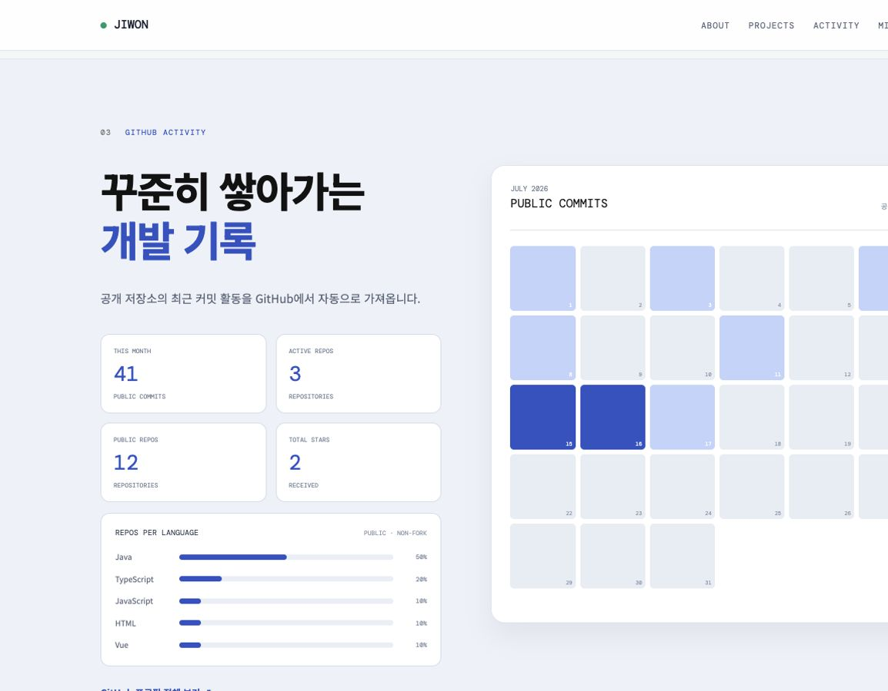
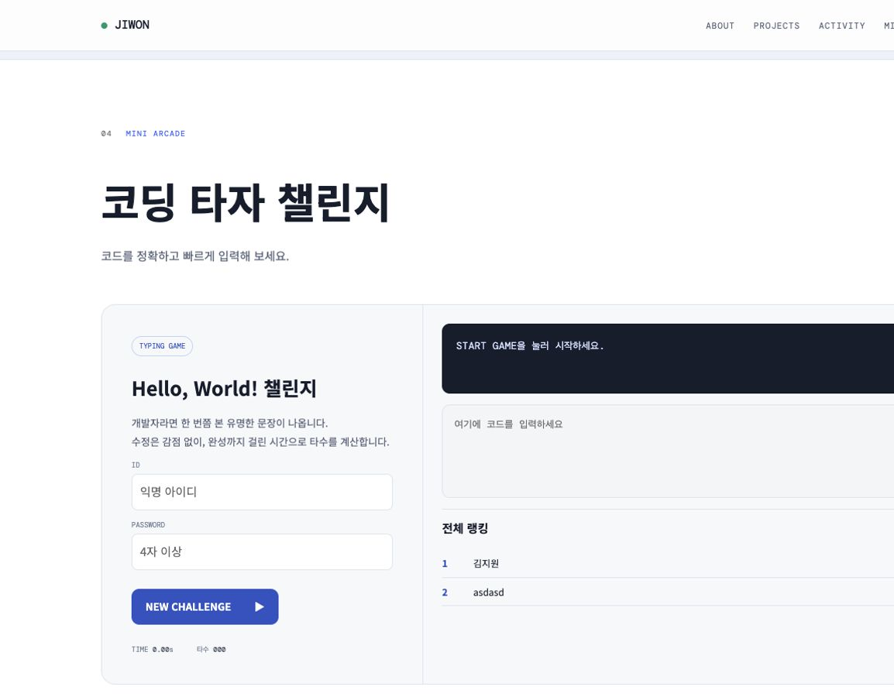

# JIWON — Profile Portfolio

백엔드와 인프라를 공부하는 김지원의 프로필, 프로젝트 경험과 개발 활동을 소개하는 자기소개 페이지입니다. 프로젝트 소개뿐 아니라 GitHub 활동, 코딩 타자 게임과 방명록을 제공하는 참여형 웹사이트로 구성했습니다.

## 배포 링크

<https://d3j0t61n2e0cz0.cloudfront.net/>

## 프로젝트 화면

### 프로필


- 관심 분야와 기술 스택을 첫 화면에서 소개합니다.
- 주요 섹션으로 이동하는 내비게이션과 GitHub 프로필 링크를 제공합니다.
- About 영역에서는 소개, 성향, 관심 분야와 학습 목표를 카드 형태로 보여줍니다.

### 프로젝트 경험


- Mung-Shall, Z멋대로, LUMEN 프로젝트 경험을 목록으로 소개합니다.
- 프로젝트를 선택하면 역할, 주요 작업, 사용 기술과 소개 영상을 모달로 표시합니다.
- 모달에서 각 프로젝트의 GitHub 저장소로 이동할 수 있습니다.

### GitHub 활동



- GitHub REST API를 사용해 공개 저장소와 최근 커밋 활동을 가져옵니다.
- 이번 달 커밋 수, 활동 저장소, 공개 저장소와 받은 Star 수를 표시합니다.
- 공개 저장소의 사용 언어 비율과 날짜별 커밋 활동을 시각화합니다.

### 코딩 타자 게임



- 화면에 제시된 명령어나 코드를 정확히 입력하면 타수를 계산합니다.
- 아이디와 비밀번호를 사용해 자신의 최고 기록을 저장합니다.
- Supabase에 저장된 전체 사용자 랭킹을 조회하고 페이지별로 표시합니다.

### 방명록


- 아이디와 비밀번호를 이용해 익명 메시지를 작성합니다.
- 동일한 아이디의 비밀번호를 확인해 메시지 수정과 삭제 권한을 구분합니다.
- 메시지를 한 페이지에 6개씩 표시하고 페이지네이션을 제공합니다.

## 주요 기능

| 기능 | 설명 | 구현 방식 |
| --- | --- | --- |
| 반응형 내비게이션 | 화면 크기에 따라 데스크톱 메뉴와 모바일 토글 메뉴 제공 | DOM 이벤트, CSS Media Query |
| 프로젝트 모달 | 프로젝트별 영상, 역할, 작업 내용과 기술 스택 표시 | JavaScript 객체 데이터, `<video>`, 모달 UI |
| GitHub 활동 | 공개 프로필, 저장소 및 이번 달 커밋 데이터 조회 | GitHub REST API, Fetch API |
| 타자 게임 | 입력 정확도와 소요 시간을 기반으로 타수 계산 | 타이머, 문자열 비교, Local Storage |
| 게임 랭킹 | 사용자 인증과 최고 기록 저장 및 순위 조회 | Supabase RPC |
| 방명록 | 메시지 작성·수정·삭제 및 페이지네이션 | Supabase RPC, DOM 렌더링 |
| 방문 횟수 | 현재 브라우저의 방문 횟수 표시 | Local Storage |

## 기술별 구현 내용

### HTML

- `header`, `nav`, `main`, `section`, `article`, `aside`, `footer` 등의 시맨틱 태그로 콘텐츠를 구분했습니다.
- 하나의 페이지 안에서 프로필, 프로젝트, 활동, 게임과 방명록 섹션으로 이동하는 구조를 사용했습니다.
- 프로젝트 소개 영상에 `<video>`를 적용하고 재생 오류 시 대체 안내를 제공합니다.
- 폼 요소의 label, 길이 제한과 패턴을 설정하고 모달에 접근성 속성을 적용했습니다.

### CSS

- 카드 기반 Bento Grid와 프로젝트 목록, 활동 통계 및 방명록 레이아웃을 구성했습니다.
- CSS 변수로 색상, 테두리와 여백을 관리해 일관된 시각 체계를 적용했습니다.
- 데스크톱과 모바일 환경에 대응하도록 Media Query와 반응형 내비게이션을 구현했습니다.
- 모달, 토스트, 타자 입력 상태와 커밋 단계별 색상 등 동적인 UI 상태를 표현했습니다.

### JavaScript

- 프로젝트 정보를 객체로 관리하고 선택한 프로젝트에 맞춰 모달 콘텐츠를 동적으로 생성합니다.
- GitHub REST API 응답을 가공해 커밋 달력, 저장소 통계와 언어 비율을 렌더링합니다.
- API 호출 결과를 Local Storage에 일정 시간 캐싱해 불필요한 요청을 줄입니다.
- 타이머와 문자열 비교를 이용해 타자 수를 계산하고 최고 기록을 관리합니다.
- Supabase RPC를 호출해 타자 기록과 방명록 데이터를 저장하고 조회합니다.
- 모달 포커스 이동, Escape 닫기, 모바일 메뉴 등 키보드와 화면 크기를 고려한 동작을 제공합니다.

## Supabase 연동

`supabase-config.js`의 설정을 이용해 배포된 Supabase 프로젝트에 연결합니다. 게임 랭킹과 방명록 기능은 네트워크 연결이 필요합니다.

주요 데이터베이스 함수와 테이블 정의는 [`supabase-schema.sql`](supabase-schema.sql)에서 확인할 수 있습니다.

## 폴더 구조

```text
profile-portfolio/
├── assets/
│   └── videos/               # 프로젝트 소개 영상
├── docs/
│   └── images/               # README 화면 이미지
├── index.html                # 전체 페이지 구조
├── profile.js                # 화면 동작 및 외부 API 연동
├── style.css                 # 반응형 스타일
├── supabase-config.js        # Supabase 연결 설정
└── supabase-schema.sql       # 테이블 및 RPC 정의
```

## 실행 방법

[`index.html`](index.html)을 브라우저에서 직접 실행하거나 프로젝트 루트에서 로컬 서버를 실행합니다.

```bash
python3 -m http.server 8000
```

브라우저에서 다음 주소로 접속합니다.

```text
http://localhost:8000/practice/profile-portfolio/index.html
```
